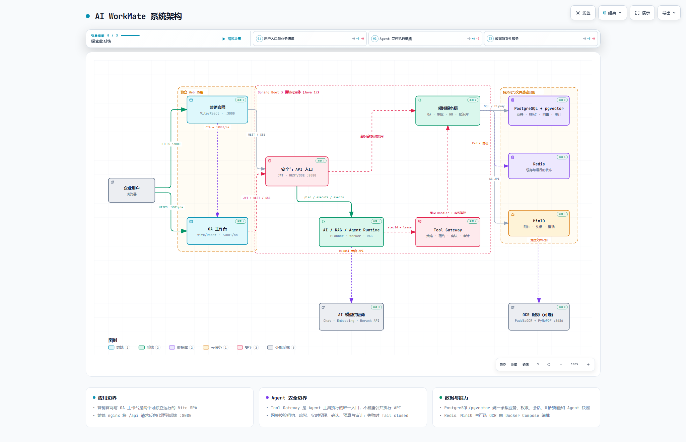

# AI WorkMate

AI WorkMate 是一个面向企业协同场景的 AI 助手与 OA 工作台平台。项目采用两个独立 Vite SPA、一个 Spring Boot 模块化单体，以及 PostgreSQL/pgvector、Redis、MinIO 等基础设施，当前已覆盖认证、动态权限、审批、人事、行政资产、知识库、流式 AI 对话和受控 Agent 执行链路。

## 系统架构

[打开 Archify 交互式系统架构图](docs/architecture/ai-workmate-system-architecture.html) · [查看架构图规格](docs/architecture/ai-workmate-system-architecture.archify.json) · [查看视觉检查报告](docs/architecture/ai-workmate-system-architecture.visual-check.html)



核心边界如下：

- `fronted-main`：营销官网，独立运行于 `3000`。
- `fonted-oa`：企业 OA 工作台，独立运行于 `3001`，根路径 `/` 跳转到 `/oa`。
- `backend`：Java 17 + Spring Boot 3 模块化单体，统一提供 REST、SSE、认证、领域服务、RAG 和 Agent 任务能力。
- Agent Runtime：Planner 与 Worker 不能直接调用工具处理器；所有 Agent 工具执行必须经过进程内 `ToolGateway.execute(stepId, workerLease)`。
- PostgreSQL + pgvector：承载业务数据、RBAC、会话、知识向量、Agent 任务快照与审计；Schema 由 Flyway 独占管理。
- Redis：用于登录保护、验证码、缓存及运行时辅助能力。
- MinIO：保存聊天附件、员工档案、印章文件、头像和壁纸等对象。
- OCR：PaddleOCR + PyMuPDF 可选服务，用于图片和扫描版 PDF 文字提取。

## 核心能力

### 企业身份与权限

- 密码登录、邮箱验证码登录、注册、重置密码、图形验证码和登录失败保护。
- Spring Security + JWT 无状态鉴权；除认证与系统健康接口外，业务 API 默认要求认证。
- 后端根据认证用户实时解析角色、权限、数据范围和租户，不依赖前端隐藏按钮保证安全。
- 动态菜单由 `GET /api/navigation` 返回；权限后台支持角色、成员、组织、权限和动态路由配置。
- 中文与英文国际化，两个前端共享 `workmeta-locale`，后端错误消息按 `Accept-Language` 返回。

### OA 工作台

- 驾驶舱、待办、通知、考勤打卡、补卡、异常、统计和考勤设置。
- 通用审批的草稿、提交、撤回、重新发起、转交、抄送、加签、催办和审批时间线。
- 审批表单、流程和规则配置，并在申请时冻结定义快照。
- 人事组织、员工档案、附件和入转调离流程。
- 资产领用、归还、调拨、维修、盘点和报废。
- 会议室预约与冲突检测、访客预约与到访生命周期、印章申请与实际用印归还。
- 动态菜单、访问页签、主题、壁纸、个人资料和服务端用户设置。
- Ant Design 业务组件、ECharts 图表和响应式中后台布局。

### AI Chat 与知识库

- 独立 `/oa/ai-workspace` 页面，包含会话列表、消息区、附件、引用和流式输入体验。
- 对话与消息服务端持久化，SSE 流式回复，认证用户只能访问自己的资源。
- 文档上传、解析、分块、向量化、pgvector 检索和 PostgreSQL 全文检索。
- 可配置本地或 OpenAI 兼容 Embedding 服务，以及可选 Rerank 服务。
- 图片和扫描版 PDF 可通过可选 OCR 服务提取文字；能力不可用时返回真实错误，不伪造成功。

### 受控 Agent

- 持久化任务、步骤、事件、租约 Worker、幂等、取消、恢复、保留清理和 SSE 进度。
- Phase 2A 只读工具：`todo.query`、`leave.mine`、`knowledge.search`、`notification.mine`。
- Phase 2B 受控写工具：`leave.createDraft`、`leave.submit`，每个任务最多一个写步骤并要求确认。
- Tool Gateway 重新校验任务快照、租户、用户、实时权限、Worker 租约、attempt、哈希、确认、预算、Kill Switch 和审计。
- 工具 Handler 只能通过固定注册表分派；领域 Service 再次校验租户、所有权、权限和业务状态。
- SQL、代码执行、文件系统、任意 URL、权限修改、删除、批量操作、敏感导出、外部消息和后台自治属于永久禁止能力。
- Agent 与写工具默认关闭；数据库策略只能进一步收紧能力，不能绕过代码安全上限。

安全设计详见 [Phase 2 Agent 安全边界](docs/roadmap/phase-2-agent-security-boundary.md)、[Tool Gateway 架构](docs/architecture/agent-tool-gateway.md) 和 [Agent 任务引擎](docs/architecture/agent-task-engine.md)。

## 技术栈

| 层级 | 技术 |
| --- | --- |
| 营销官网 | Vite 5、React 18、TypeScript、Tailwind CSS、Ant Design、Zustand、i18next |
| OA 工作台 | Vite 5、React 19、TypeScript、React Router、Ant Design、ECharts、G6、Zustand、i18next |
| 后端 | Java 17、Spring Boot 3.3.5、Spring Security、Spring AI 1.0、Bean Validation |
| 数据访问 | MyBatis-Plus 3.5、PostgreSQL 16、pgvector、Flyway |
| 基础设施 | Redis 7、MinIO、Docker Compose、Nginx |
| 文件与检索 | Apache Tika、Embedding、pgvector、PostgreSQL 全文检索、可选 Rerank |
| OCR | FastAPI、PaddleOCR、PyMuPDF，可选启用 |
| 测试 | JUnit 5、Spring Boot Test、ArchUnit、Testcontainers、Vitest、Playwright |

## 仓库结构

```text
ai-workmate/
├─ fronted-main/                  # 营销官网独立 Vite SPA，端口 3000
├─ fonted-oa/                     # OA 工作台独立 Vite SPA，端口 3001，base=/oa/
├─ backend/                       # Spring Boot 模块化单体，端口 8080
│  └─ src/main/
│     ├─ java/com/aiworkmate/
│     │  ├─ config/               # Security、AI、存储与框架配置
│     │  ├─ controller/           # REST/SSE 协议入口
│     │  ├─ service/              # 领域服务接口与实现
│     │  ├─ mapper/               # MyBatis-Plus 数据访问
│     │  ├─ entity/               # 数据库实体
│     │  ├─ dto/                  # API 请求/响应契约
│     │  ├─ security/             # JWT 与认证上下文
│     │  └─ agent/                # Planner、任务引擎、Gateway、Registry、Worker、Handler
│     └─ resources/
│        ├─ application.yml
│        └─ db/migration/         # Flyway 版本化迁移，唯一 Schema 入口
├─ docker/ocr-service/            # 可选 OCR 服务源码
├─ docs/                          # 架构、规则、路线图、交付报告与 Skills
├─ scripts/                       # 部署、数据库验收、OCR 与 Iconfont 工具
├─ docker-compose.yml             # 基础设施、后端、两个前端和可选 OCR
├─ start.bat                      # Windows 本地多服务启动器
├─ .env.example                   # 本地开发配置模板
└─ .env.docker.example            # Docker 部署配置模板
```

> 目录名 `fronted-main` 和 `fonted-oa` 是当前仓库的既有名称。旧 `frontend` 边界已废弃，不要重新合并两个前端。

## 运行端口

| 服务 | 地址 | 说明 |
| --- | --- | --- |
| 营销官网 | <http://localhost:3000> | “立即尝试”进入 OA |
| OA 工作台 | <http://localhost:3001/oa/> | 独立 SPA |
| 后端 API | <http://localhost:8080> | REST 与 SSE |
| 健康检查 | <http://localhost:8080/api/system/health> | 无需认证 |
| PostgreSQL | `localhost:5432` | 默认开发数据库 `ai_workmate_dev` |
| Redis | `localhost:6379` | 本地基础设施 |
| MinIO API / Console | `localhost:9000` / <http://localhost:9001> | 对象存储与管理界面 |
| OCR | `localhost:8686` | 仅本地独立安装时直接暴露；Compose 内默认只供后端访问 |

## 快速开始

### 前置要求

- Java 17
- Maven 3.9+
- Node.js 20+ 与 npm
- Docker Desktop 或兼容的 Docker Compose 环境
- PostgreSQL 16 + pgvector、Redis 7、MinIO（推荐直接使用 Compose）
- 64 位 Python 3.10/3.11（仅本地安装 OCR 时需要）

### 1. 准备本地配置

PowerShell：

```powershell
Copy-Item .env.example .env
```

Bash：

```bash
cp .env.example .env
```

至少检查并替换：

- `DB_PASSWORD`
- `JWT_SECRET`（至少 32 字节随机值）
- `AI_API_KEY`
- `MINIO_ACCESS_KEY` / `MINIO_SECRET_KEY`
- 邮箱登录需要的 `SMTP_*`
- 知识库需要的 `EMBEDDING_*`；默认 `local` 模式要求本地 Embedding 服务运行于 `127.0.0.1:18080`

不要提交 `.env`、`.env.docker`、真实账号、Token、API Key 或生产连接串。

### 2. 启动基础设施

```bash
docker compose up -d postgres redis minio
```

后端启动时会自动执行 `backend/src/main/resources/db/migration` 中的 Flyway 迁移，无需手工执行 `init.sql`。

### 3. 启动后端

```bash
cd backend
mvn spring-boot:run
```

### 4. 启动两个前端

分别打开两个终端：

```bash
cd fronted-main
npm install
npm run dev
```

```bash
cd fonted-oa
npm install
npm run dev
```

访问 <http://localhost:3000> 或直接打开 <http://localhost:3001/oa/>。

### Windows 一键打开开发服务

首次完成两个前端的 `npm install`，并确保 PostgreSQL、Redis、MinIO 已启动后，可运行：

```powershell
.\start.bat
```

启动器会检查 Java、Maven、npm 和 Windows Terminal，释放 `8080`、`3000`、`3001` 端口，然后分别打开后端、官网和 OA 标签页；如已安装 OCR，也会启动 `8686` 服务。

## Docker Compose 全栈部署

```powershell
Copy-Item .env.docker.example .env.docker
docker compose --env-file .env.docker up -d --build
```

必须显式传入 `--env-file .env.docker`，否则 Compose 不会读取该文件中的构建期变量，例如 `VITE_OA_URL`。

默认启动 PostgreSQL、Redis、MinIO、后端、营销官网和 OA。启用可选 OCR：

```bash
docker compose --env-file .env.docker --profile ocr up -d --build
```

部署形态支持：

- 分端口：主站 `3000`，OA `3001/oa/`。
- 同域名反向代理：设置 `VITE_OA_URL=/oa/`，由外部 Nginx 将 `/oa/` 转发到 OA 容器。
- 独立 OA 域名：将 `VITE_OA_URL` 设置为完整 OA 地址。

生产部署前必须替换模板中的所有密钥和占位值，并启用 HTTPS；`AUTH_COOKIE_SECURE` 应设置为 `true`。

## 可选 OCR

OCR 用于图片与扫描版 PDF 的聊天和知识库文本提取。未启用时主链路仍可运行，但相关识别请求会明确返回能力不可用。

Windows 本地安装：

```powershell
.\start.bat --install-ocr
```

Docker 启用方式见上一节。OCR 主要配置：

- `OCR_ENABLED`
- `OCR_BASE_URL`
- `OCR_API_KEY`
- `OCR_USE_GPU`
- `OCR_MAX_PAGES`
- `OCR_TIMEOUT_MS`
- `OCR_MIN_CONFIDENCE`

更多说明见 [OCR 聊天处理链路](docs/architecture/ocr-chat-pipeline.md)。

## Agent 启用说明

Agent 的安全默认值是全部关闭：

```dotenv
AGENT_ENABLED=false
AGENT_PLANNING_ENABLED=false
AGENT_EXECUTION_ENABLED=false
AGENT_WRITE_TOOLS_ENABLED=false
```

本地验收 Phase 2A 时，可以在受控环境中开启前三项，但还必须在 `agent_tenant_policy` 中显式启用目标租户。环境变量不能覆盖租户策略、Registry、实时权限、风险等级、确认或永久禁止清单。

`AGENT_WRITE_TOOLS_ENABLED` 属于 Phase 2B 全局发布门。即使设置为 `true`，写工具仍需租户写策略、工具策略、实时权限和一次性确认全部通过；未经独立人工批准不得在生产启用。

## 数据库迁移

- Flyway 是部署环境 Schema 的唯一入口，迁移位于 `backend/src/main/resources/db/migration`。
- `V1`–`V4` 是已发布基线，文件名和内容不得修改。
- 新迁移使用 `VYYYYMMDDHHMM__description.sql`，以分钟粒度递增。
- 已执行迁移禁止重命名、删除或修改 checksum；修正结构必须新增更高版本的前向迁移。
- 迁移保持幂等，不在脚本中手写 `BEGIN` / `COMMIT`。
- `backend/src/main/resources/db/init.sql` 只作为历史手工初始化和 CI 参考，不再自动执行。

真实 PostgreSQL 验证入口：

```powershell
.\scripts\verify-p1-postgres.ps1 `
  -DatabaseUrl 'jdbc:postgresql://localhost:5432/ai_workmate_dev' `
  -DatabaseUsername 'postgres' `
  -DatabasePassword '<password>'
```

## 验证命令

营销官网：

```bash
cd fronted-main
npm install
npm run lint
npm run build
```

OA 工作台：

```bash
cd fonted-oa
npm install
npm run lint
npm run test
npm run build
```

后端：

```bash
cd backend
mvn test
```

涉及数据库、权限、SSE、Agent Gateway 或写工具的改动，还必须运行相应真实 PostgreSQL、安全失败路径和架构边界测试。没有可用 Java 17、Maven、Docker 或外部模型环境时，应明确记录未执行项，不能把跳过描述为通过。

## 重要配置

| 配置组 | 关键变量 |
| --- | --- |
| 数据库 | `DB_URL`、`DB_USERNAME`、`DB_PASSWORD` |
| Redis | `REDIS_URL`、`REDIS_PASSWORD`、`REDIS_DATABASE` |
| JWT / Cookie | `JWT_SECRET`、`AUTH_COOKIE_NAME`、`AUTH_SESSION_TTL`、`AUTH_COOKIE_SECURE` |
| AI Chat | `AI_API_KEY`、`AI_BASE_URL`、`AI_MODEL` |
| Agent | `AGENT_ENABLED`、`AGENT_PLANNING_ENABLED`、`AGENT_EXECUTION_ENABLED`、`AGENT_WRITE_TOOLS_ENABLED` |
| MinIO | `MINIO_ENDPOINT`、`MINIO_ACCESS_KEY`、`MINIO_SECRET_KEY`、`MINIO_BUCKET` |
| Embedding | `EMBEDDING_ENABLED`、`EMBEDDING_PROVIDER`、`EMBEDDING_LOCAL_*`、`EMBEDDING_API_*` |
| Rerank | `RERANK_ENABLED`、`RERANK_API_BASE_URL`、`RERANK_API_KEY`、`RERANK_MODEL` |
| OCR | `OCR_ENABLED`、`OCR_BASE_URL`、`OCR_API_KEY`、`OCR_*` |
| 邮件 | `SMTP_HOST`、`SMTP_PORT`、`SMTP_USERNAME`、`SMTP_PASSWORD`、`SMTP_FROM_EMAIL` |

完整说明以 [.env.example](.env.example)、[.env.docker.example](.env.docker.example) 和 [application.yml](backend/src/main/resources/application.yml) 为准。

## 文档索引

### 架构

- [系统架构图](docs/architecture/ai-workmate-system-architecture.html)
- [企业认证架构](docs/architecture/enterprise-auth.md)
- [AI Chat Workspace](docs/architecture/ai-chat-workspace.md)
- [Embedding 与 pgvector](docs/architecture/embedding-pgvector.md)
- [OCR 聊天处理链路](docs/architecture/ocr-chat-pipeline.md)
- [Agent Tool Gateway](docs/architecture/agent-tool-gateway.md)
- [Agent 持久任务引擎](docs/architecture/agent-task-engine.md)

### 规则与协作

- [工程规范](docs/rules/engineering-rules.md)
- [前端规范](docs/rules/frontend-rules.md)
- [后端规范](docs/rules/backend-rules.md)
- [Agent 规范](docs/rules/agent-rules.md)
- [国际化规范](docs/rules/i18n-rules.md)
- [Git 与提交规范](docs/rules/git-rules.md)
- [仓库 Agent 入口规范](AGENTS.md)

## 已知限制

- AI、Embedding、Rerank、SMTP、MinIO 和 OCR 是否可用取决于服务端配置与外部服务状态；健康检查“已配置”不等于真实外部推理成功。
- OA 仍有较大的前端 chunk，构建可能输出体积警告；后续需要继续做路由级拆包。
- OCR、Rerank 和 SMTP 是可选能力；未配置时对应功能不可用，但不得回退为伪造成功。
- Phase 2A/2B 的自动化发布门通过不等于生产授权；Agent 总开关、租户策略和写工具发布门必须独立审批。
- 文件元数据存放在 PostgreSQL，对象存放在 MinIO；数据库回滚不会自动恢复或删除对象文件。

## 协作约定

- 修改项目前先阅读 [AGENTS.md](AGENTS.md) 及对应 `docs/rules`、`docs/skills`。
- 前后端接口变更必须同步更新 DTO、TypeScript 类型、调用方、国际化资源和文档。
- 不提交密钥、真实账号、生产连接串、数据库转储或用户隐私数据。
- 安全、鉴权、数据一致性、流式体验和失败路径优先于视觉效果。
- 新能力必须提供本地验证方式；无法验证时必须说明环境限制。
