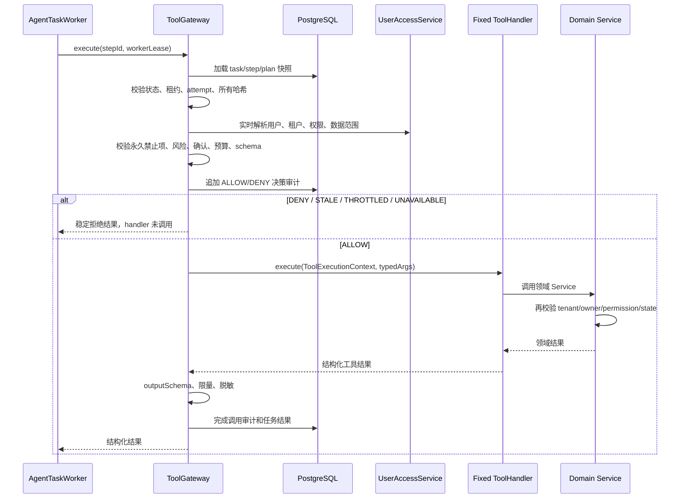

# Agent Tool Gateway 架构设计

## 1. 目标

Tool Gateway 是 Phase 2 所有 Agent 工具执行的唯一入口，用于防止模型、Worker 或其他 Agent 组件绕过权限和策略直接控制业务能力。

它只约束 Agent 执行路径，不替代普通 OA Controller 调用领域 Service 的既有业务入口，也不替代领域 Service 自身鉴权。

## 2. 部署形态

- Phase 2 采用模块化单体内的进程内组件，不单独部署微服务。
- 不提供 `/api/tools/execute`、MCP、RPC 或其他公共调用入口。
- 浏览器只调用 AI task 的 plan、confirmation、execute、query、cancel 和 events 接口。
- LLM 只能生成候选计划，不能持有 Tool Gateway 引用。
- Worker 只能调用 `ToolGateway.execute(stepId, workerLease)`。

## 3. 建议包结构

```text
com.aiworkmate.agent
├─ gateway
│  ├─ ToolGateway.java
│  ├─ DefaultToolGateway.java
│  ├─ GatewayDecision.java
│  ├─ GatewayDecisionCode.java
│  ├─ ToolExecutionContext.java
│  └─ HandlerResolver.java
├─ registry
│  ├─ ToolRegistry.java
│  └─ ToolDefinition.java
├─ policy
│  ├─ AgentPolicyGuard.java
│  └─ AgentSafetyLimits.java
├─ task
│  ├─ AgentTaskWorker.java
│  └─ AgentTaskStateMachine.java
└─ tool.internal
   ├─ ToolHandler.java
   ├─ TodoQueryToolHandler.java
   └─ ...
```

`tool.internal` 只能被 `gateway` 依赖。该约束必须由 ArchUnit 或等价测试验证，不能仅依靠开发约定。

## 4. 最小接口

示意接口：

```java
public interface ToolGateway {
    ToolGatewayResult execute(long stepId, WorkerLease lease);
}
```

禁止提供以下接口：

```java
execute(String toolCode, Map<String, Object> args, Long userId)
executeAsAdmin(...)
testTool(...)
```

原因是调用者可以借此绕过持久计划、伪造身份、修改参数或跳过确认。

## 5. 执行时序



## 6. 网关检查顺序

检查顺序固定，任一步失败立即停止：

1. Kill Switch、租户开关和工具开关。
2. taskId、stepId、tenantId、userId 关联关系。
3. task=RUNNING、step 可执行、workerId、leaseUntil、attempt。
4. planHash、planVersion、toolVersion、schemaHash、argsHash。
5. 用户有效状态、实时 RBAC、数据范围。
6. Agent 永久禁止清单和工具风险策略。
7. Phase 2B 单写步骤上限与 confirmation evidence。
8. 用户、租户、任务和工具限流/预算。
9. inputSchema 与资源归属预检。
10. 前置决策审计成功。
11. 固定 handler 分派。
12. outputSchema、结果条数/字节数与敏感字段过滤。
13. 调用结果审计和步骤状态更新。

## 7. 不可变数据来源

网关不得信任 Worker 或客户端提交的下列字段：

- userId、tenantId、role、permission、dataScope；
- toolCode、toolVersion、args、riskLevel；
- planHash、planVersion、schemaHash、argsHash；
- confirmationRequired、confirmationToken 已消费状态；
- task status、step status 和 attempt。

这些字段全部从 PostgreSQL 任务快照、代码注册表和实时权限服务重新获得。Worker lease 虽由 Worker 传入，也必须与数据库当前租约完全匹配。

## 8. 决策与错误

| 网关决策 | 对外错误码示例 | 是否调用 handler |
| --- | --- | --- |
| ALLOW | 无 | 是 |
| DENY | `GATEWAY_DENIED` | 否 |
| STALE | `GATEWAY_STALE` | 否 |
| THROTTLED | `GATEWAY_THROTTLED` | 否 |
| UNAVAILABLE | `GATEWAY_UNAVAILABLE` | 否 |

具体拒绝原因只进入脱敏安全审计。前端和模型不能获得权限策略、表结构、类名或内部安全配置。

## 9. 纵深鉴权

Tool Gateway 不是唯一授权层：

- 网关负责 Agent 路径、任务完整性、实时权限、风险和预算。
- ToolHandler 负责把封闭参数转换为领域请求。
- Domain Service 负责最终 tenantId、owner/assignee、资源状态和业务权限校验。
- Mapper 查询必须尽量把 tenantId、owner/assignee 和状态条件放入 SQL，不采用“仅按 ID 查询后在内存判断”。

因此即使网关出现策略缺陷，领域层仍能阻止跨租户、跨用户和非法状态写入。

资源可能在网关预检和领域写入之间发生变化，因此写操作必须在领域 Service 内使用带 tenant、owner、version、status 条件的原子更新；不得依赖网关早先读取的资源快照。

## 10. 事务、幂等与审计一致性

- 网关前置 ALLOW/DENY 决策必须在 handler 前持久化，失败则不调用 handler。
- 写工具的业务变更和 `business_audit_log` 必须处于同一领域事务；无法保证原子业务审计的写工具不得进入 Phase 2B。
- `agent_tool_invocation` 完成记录可以在领域事务后更新，但如果更新失败，必须保留前置 ALLOW 记录、记录低敏错误并停止后续步骤，不能假定业务写入未发生。
- Worker 在 handler 完成后、步骤落库前崩溃时，可能出现结果未知；写工具必须依赖领域幂等键或条件状态更新，恢复后先查询业务结果，不允许盲目重放。
- 不得开启跨模型调用、队列等待和工具执行的长数据库事务。

## 11. 数据库与迁移

新增 `agent_tool_invocation` 记录网关决策与调用结果。结构和索引必须通过新的 Flyway `V*__agent_tool_gateway.sql` 迁移创建；不得修改已发布迁移，也不得向历史 `init.sql` 追加。

至少建立：

- `(tenant_id, user_id, started_at DESC)`；
- `(task_id, step_id, attempt)`；
- `decision_id` 唯一索引；
- `(decision, started_at)` 安全审计索引。

参数只保存 argsHash 或明确允许的脱敏摘要，不保存 confirmationToken、JWT、Prompt、完整知识内容或敏感结果。

## 12. 必测绕过场景

- Controller、Planner、Task Service、Worker 直接依赖 ToolHandler，ArchUnit 测试失败。
- 未注册 toolCode、数据库伪造 handler 名、降低 riskLevel，网关拒绝。
- 跨租户 stepId、跨用户 taskId、错误 workerId、过期 lease，handler 调用次数为 0。
- 修改 args、plan、schema、toolVersion 或 attempt 后执行，返回 STALE。
- plan 后禁用用户、撤销权限、改变资源 owner，返回 DENY。
- confirmationToken 重放或 planHash 不匹配，handler 调用次数为 0。
- Kill Switch、权限服务、Registry、Policy、限流或前置审计不可用，返回 UNAVAILABLE。
- 网关允许但领域 Service 检测资源状态冲突时，业务写入为 0，记录领域拒绝。
- Worker 在业务写入后、步骤完成前崩溃，恢复流程通过领域幂等或结果核验避免第二次写入。
- 恶意输出、超量结果和危险链接被过滤，不能进入 SSE 或前端 HTML。

## 13. 已知边界与演进条件

进程内 Tool Gateway 是代码架构和执行路径边界，不是针对恶意服务端代码或 JVM 被攻陷的进程级沙箱。其防绕过依赖包边界、ArchUnit、代码评审、CI 和发布控制。

如果未来允许第三方工具、任意网络出口、跨系统写入或不可信插件，必须停止沿用进程内模型，单独评审隔离 Tool Runner 服务、服务身份、mTLS、网络出口白名单和独立凭证；该能力不属于 Phase 2。

## 14. 完成标准

- 所有 Agent ToolHandler 只能由 Tool Gateway 分派。
- 网关没有公共网络入口和管理员代执行入口。
- 伪造调用在 handler 前被拒绝，并有追加式安全审计。
- 领域 Service 二次鉴权测试通过。
- Phase 2A 安全发布门包含网关防绕过演练；未通过不得启用任何写工具。
