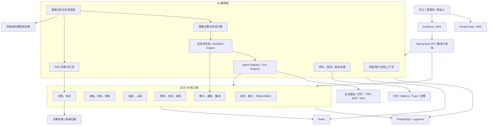
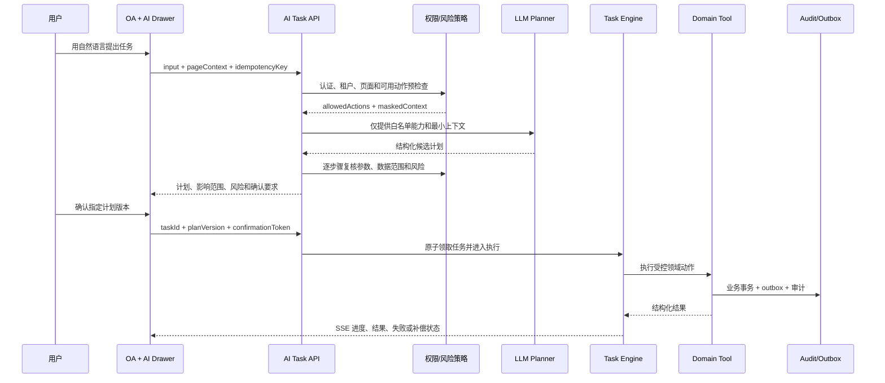
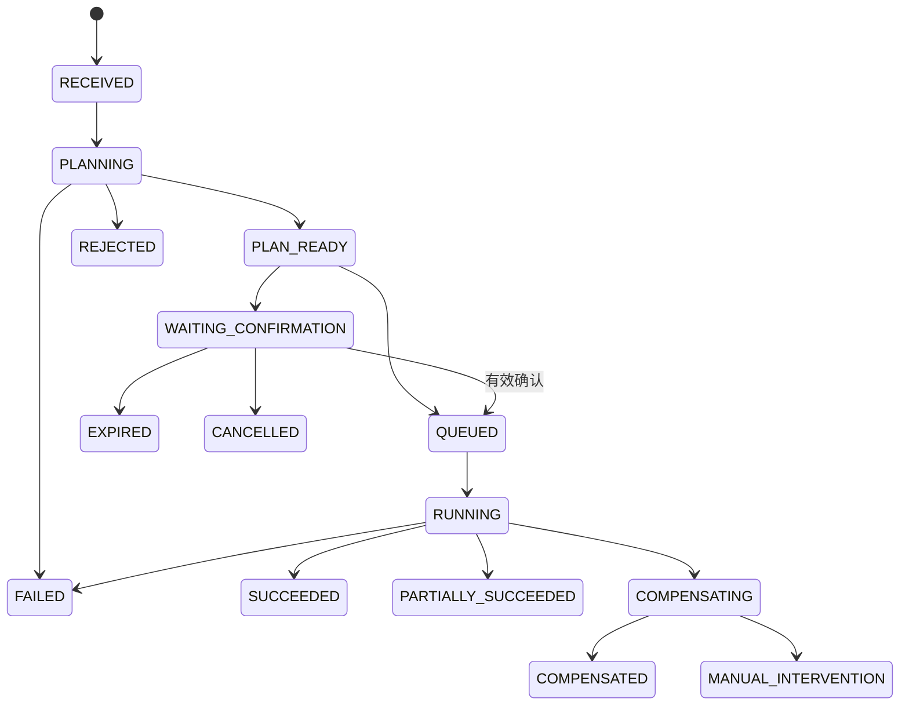

# AI WorkMate 企业级 AI OA 架构与迭代计划

## 1. 文档定位

### 1.1 目标

本计划用于指导 AI WorkMate 从当前 OA 基础联调版本演进为可在企业环境落地的 AI 原生 OA 平台，覆盖：

- 营销官网、OA 工作台、统一身份与权限、组织和数据权限。
- SSE 对话、RAG 知识库、任务规划、Tool Calling、工作流与多 Agent。
- AI 对 OA 页面导航、查询、筛选、填表、提交、审批、导出等操作的受控协助。
- 审计、幂等、补偿、可观测、评估、部署、灾备和成本治理。

### 1.2 核心结论

“AI 能操控 OA 的任何界面”不能实现为让模型直接操作 DOM、拼接接口或绕过权限。企业级实现必须采用两类受控能力：

1. **界面协助能力**：通过页面能力清单和结构化 UI Command 完成跳转、定位、筛选、打开抽屉、填充表单和展示预览。此类操作不得直接产生不可逆业务副作用。
2. **业务执行能力**：通过服务端白名单 Tool 调用真实领域服务。所有写操作必须经过身份、租户、RBAC/ABAC、数据范围、风险分级、人工确认、幂等和审计校验。

因此，AI 的能力上限始终等于当前用户在当前租户、当前数据范围内的能力上限；AI 不能获得额外权限。

### 1.3 适用规范

实施时必须同时遵守：

- `AGENTS.md`
- `docs/rules/engineering-rules.md`
- `docs/rules/frontend-rules.md`
- `docs/rules/backend-rules.md`
- `docs/rules/agent-rules.md`
- `docs/skills/oa-workbench-skill.md`
- `docs/skills/backend-engineering-skill.md`
- `docs/skills/agent-engineering-skill.md`

### 1.4 非目标

- 不允许通过浏览器自动点击替代稳定的业务 API。
- 不允许模型直接生成 SQL、调用任意 URL、执行脚本或写数据库。
- 不以多 Agent 数量衡量能力；单 Agent + 确定性工作流能完成时不引入多 Agent。
- 不在真实依赖缺失时返回模拟成功或 fallback mock。
- 首阶段不拆分微服务；优先采用模块化单体，待边界、团队规模和负载明确后再拆分。

## 2. 当前基线与差距

### 2.1 已具备能力

- `fronted-main` 与 `fonted-oa` 已是两个独立 Next.js 应用，分别运行在 `3000` 和 `3001`。
- 后端采用 Spring Boot 3、Java 17、Spring Security、JWT、Spring AI、MyBatis-Plus、PostgreSQL/Redis 方向。
- 已存在登录注册、JWT、SSE 聊天、会话与消息持久化基础链路。
- OA 已具备路由入口、Ant Design 布局、菜单权限演示、Dashboard、AI Drawer、主题与 ECharts。
- 后端已有统一 `Result<T>`、全局异常处理及知识上下文扩展接口。

### 2.2 经仓库核查的 P0 差距

| 差距 | 当前表现 | 目标状态 |
| --- | --- | --- |
| AI 任务仍为 mock | 后端仍存在 `MockAiTaskServiceImpl` 并返回模拟执行成功 | 未接真实工具时返回 `CAPABILITY_UNAVAILABLE`；接入后只执行白名单工具 |
| 前端仍有 fallback mock | `oaApi.ts` 仍包含本地计划和执行成功构造逻辑 | 删除 fallback；完整展示真实错误、重试与能力不可用状态 |
| AI 接口匿名放行 | `/api/ai/tasks/**` 当前 `permitAll` | plan/execute 必须认证；health 仅暴露最小公开信息 |
| 角色由前端传入 | plan 请求包含可篡改的 `role` | 角色、租户、数据范围只从服务端认证上下文获取 |
| 缺少领域能力 | OA 多数页面仍是菜单和演示数据 | 建设审批、待办、组织、人事、合同、财务等真实领域服务 |
| 缺少页面操作协议 | AI 仅知道 `pageId` 和若干静态动作 | 建立 Page Capability Manifest、UI Command 和上下文快照协议 |
| 缺少任务闭环 | 只有 plan/execute DTO | 建立持久化状态机、确认凭证、步骤日志、取消、重试、补偿 |
| 权限仅前端演示 | 本地 `can()`、`filterMenusByRole()` 不能代替鉴权 | 后端 RBAC + ABAC + dataScope + tenantId 强制执行 |
| RAG 未闭环 | 只有空知识上下文实现 | 完成入库、解析、切分、混合检索、引用、权限过滤与评估 |
| 数据库方向未完全收敛 | 同时保留 MySQL/H2/PostgreSQL 相关资源 | 明确 PostgreSQL + pgvector 为目标生产基线，测试使用兼容方案 |

## 3. 产品能力蓝图

### 3.1 AI 操作等级

| 等级 | 能力 | 示例 | 默认策略 |
| --- | --- | --- | --- |
| L0 问答 | 解释页面、制度和数据口径 | “这个审批节点是什么意思？” | 可自动执行，只读 |
| L1 导航 | 跳页、定位组件、打开面板 | “打开我的待办” | 可自动执行，无业务副作用 |
| L2 草拟 | 查询、筛选、填表、生成草稿、预览 | “帮我填一份请假申请” | 允许自动填充，提交前由用户检查 |
| L3 受控执行 | 提交、催办、普通导出、更新本人数据 | “提交这份申请” | 权限校验 + 明示确认 + 幂等 |
| L4 高风险执行 | 审批、批量操作、权限变更、敏感导出、付款 | “批量通过这些付款审批” | 强认证 + 二次确认 + 最小范围 + 审计；部分动作永久禁止 AI 执行 |

### 3.2 目标业务域

- 个人工作台：待办、日程、消息、通知、常用应用、个人数据。
- 流程中心：流程定义、发起、审批、抄送、催办、撤回、转交和委托。
- 组织人事：组织、岗位、员工、入转调离、考勤、请假和证明材料。
- 财务合同：报销、付款、预算、发票、采购、合同、供应商与风险提醒。
- 文档知识：企业制度、项目文档、合同资料、会议纪要和权限化检索。
- 管理平台：租户、角色、权限、菜单、数据范围、工具、模型、Prompt、审计和运行日志。

每个领域必须先有真实、可测试的领域 API，才能注册为 AI 工具。AI 不能替代尚不存在的业务能力。

## 4. 目标总体架构



### 4.1 架构原则

- **模块化单体优先**：按 `iam`、`workflow`、`organization`、`finance`、`knowledge`、`agent`、`audit` 分包，禁止跨域直接访问 Mapper。
- **API First**：页面、AI 和外部集成都调用相同的领域 Service，不复制业务规则。
- **确定性执行**：模型负责理解和生成候选计划；权限、状态流转、事务和副作用由代码控制。
- **默认拒绝**：工具、字段、数据范围或依赖不明确时拒绝执行。
- **异步解耦**：长任务通过 job/事件处理，事务写入采用 outbox，避免模型请求占用业务事务。
- **可演进拆分**：当某领域存在独立扩缩容、独立发布或团队边界时，再从模块化单体拆为服务。

## 5. “AI 操控任意 OA 界面”的实现方案

### 5.1 页面能力清单 Page Capability Manifest

每个 OA 路由必须注册一份稳定、可版本化的页面能力清单，AI 不读取任意 DOM 推断业务语义。

```ts
interface PageCapabilityManifest {
  pageId: string;
  route: string;
  version: string;
  title: string;
  contextSchema: object;
  readableResources: string[];
  uiCommands: UiCommandDefinition[];
  businessActions: string[];
  sensitiveFields: string[];
}
```

示例：审批列表页可声明 `navigate`、`setFilters`、`selectRows`、`openDetail`、`fillComment` 等 UI Command，并关联 `approval.query`、`approval.previewDecision`、`approval.submitDecision` 等服务端工具。

### 5.2 页面上下文快照

前端只上传完成任务所需的最小结构化上下文：

- `pageId`、`route`、manifest 版本。
- 当前筛选条件、分页、排序和已选择记录 ID。
- 可见组件和允许的 UI Command。
- 当前记录的版本号或 ETag。
- 对敏感字段进行删除、掩码或摘要，不上传整页 DOM、隐藏字段或无关表格数据。

服务端从认证上下文补齐 `userId`、`tenantId`、角色、权限和数据范围，禁止信任前端传来的用户或角色声明。

### 5.3 UI Command 协议

UI Command 只改变界面状态或形成草稿，使用判别联合和 schema 校验：

```json
{
  "commandId": "cmd_01",
  "type": "form.fill",
  "pageId": "leave-create",
  "manifestVersion": "1.2.0",
  "target": "leaveForm",
  "payload": { "leaveType": "annual", "startAt": "...", "reason": "..." },
  "expiresAt": "..."
}
```

首批允许命令：

- `navigation.open`
- `panel.open`
- `table.setFilters`
- `table.setSorter`
- `table.selectRows`
- `record.openDetail`
- `form.fill`
- `form.validate`
- `draft.preview`
- `message.show`

禁止把 `form.submit`、`approval.pass`、`record.delete` 等业务副作用伪装成 UI Command；它们必须走服务端 Tool。

### 5.4 统一业务动作目录 Action Catalog

页面按钮、快捷操作和 AI Tool 必须映射到同一个业务动作标识，例如：

- `todo.query`
- `leave.createDraft`
- `leave.submit`
- `approval.previewDecision`
- `approval.submitDecision`
- `contract.query`
- `contract.exportSummary`
- `employee.updateDepartment`

每个动作定义资源、参数、所需权限、数据范围、风险、确认策略、幂等策略、超时、补偿和审计级别。这样才能保证“人点按钮”和“AI 代办”执行相同规则。

### 5.5 端到端执行链路



## 6. AI 编排与任务模型

### 6.1 Agent 分工

- **OA Copilot**：唯一用户入口，负责理解目标、解释计划和汇总结果。
- **Planner**：把目标转成结构化步骤，不直接执行工具。
- **Policy Guard**：确定性校验权限、数据范围、风险和确认条件，不由 LLM 代替。
- **Domain Worker**：按领域执行少量白名单工具；一次只处理单一职责。
- **Verifier**：校验工具结果、业务前后条件和用户目标是否达成。

多 Agent 仅用于跨领域长任务。所有 Agent 间使用结构化 DTO，设置最大步骤数、最大工具次数、token/费用预算、总超时和明确退出条件。

### 6.2 最小 Agent 合约

每个 Agent 必须登记：

- `id`、`name`、`description`、`version`、`owner`。
- `systemPromptVersion`、`tools`、`outputSchema`。
- `memoryPolicy`、`safetyPolicy`、`timeout`、`budget`。
- 允许的租户/角色/场景、失败兜底、观测指标和评估集版本。

### 6.3 任务状态机



关键约束：

- plan 与 execute 分离，执行时必须校验 `planVersion`，禁止执行过期计划。
- 确认凭证绑定 `userId + tenantId + taskId + planHash + impactSummary + expiresAt`，且一次性使用。
- 执行前重新校验权限、记录版本和业务状态，防止确认后条件变化。
- 重试只允许发生在已声明安全的步骤；非幂等外部副作用必须先查询执行结果。
- 用户可取消尚未进入不可取消区的任务；系统需明确显示取消是否成功。

### 6.4 Tool 合约

```text
toolName: approval.submitDecision
version: 1.0.0
inputSchema: JSON Schema
outputSchema: JSON Schema
requiredPermissions: [approval:decision]
dataScope: department_or_assigned
riskLevel: HIGH
confirmationPolicy: explicit
idempotency: required
timeout: 10s
retryPolicy: no_automatic_retry
compensation: approval.revokeDecision（仅业务允许时）
auditLevel: full
owner: workflow-domain
```

工具执行器必须实施：schema 校验、租户隔离、资源归属、字段级授权、业务前置条件、幂等、超时、熔断、结果脱敏和审计。模型只提交候选参数，不能决定是否授权。

## 7. 身份、权限与安全架构

### 7.1 身份与会话

- 接入企业 SSO 时优先使用 OIDC/OAuth 2.1；保留本地账号作为开发或受控备份方案。
- access token 短时有效；refresh token 轮换、可撤销并检测重放。
- 高风险操作要求近期认证或 MFA，不能只依赖长时间有效 JWT。
- 密钥只从环境变量或 Secret Manager 注入，生产启动时拒绝默认密钥。

### 7.2 授权模型

采用 RBAC + ABAC + Data Scope：

- RBAC：角色到菜单、按钮、API 和 AI 动作权限。
- ABAC：基于部门、岗位、流程节点、金额、记录状态、时间和设备风险动态判断。
- Data Scope：本人、本部门及下级、指定组织、指定项目、全租户。
- Tenant：所有业务表、缓存键、向量检索、审计和事件均包含 `tenantId`。
- 字段级策略：薪酬、证件、银行账户、合同金额等字段按需脱敏或禁止进入模型上下文。

前端权限只用于体验；Controller/Service/Tool Executor 必须再次校验。任何资源 ID 都不能仅凭“前端不可见”视为安全。

### 7.3 AI 专项防护

- 对用户输入、检索文档和工具返回进行信任分层，文档中的指令不能覆盖系统策略。
- RAG 内容用明确分隔和来源元数据注入；检测 prompt injection、越权索取和数据外泄意图。
- 模型输入输出经过 DLP/敏感信息策略；日志禁止记录完整 prompt、JWT、密钥或完整文件。
- 模型供应商按数据等级路由；高度敏感数据只允许进入获批模型或本地模型。
- Tool Registry 默认无工具，按 Agent、租户、角色和场景最小授权。
- 禁止通用 HTTP、SQL、脚本、文件系统写入和任意代码执行工具进入生产白名单。

### 7.4 风险与确认矩阵

| 风险 | 示例 | 处理 |
| --- | --- | --- |
| LOW | 导航、读取本人待办、解释字段 | 可直接执行，保留轻量审计 |
| MEDIUM | 填表、创建草稿、普通查询汇总 | 显示变更预览；提交动作需确认 |
| HIGH | 审批、更新组织关系、敏感导出、外部通知 | 二次确认、影响范围、一次性确认凭证、完整审计 |
| CRITICAL | 付款、批量删除、权限提升、密钥操作 | 默认禁止 AI 自动执行；仅允许生成建议或进入专用人工流程 |

## 8. 数据与持久化设计

### 8.1 核心表建议

| 模块 | 表 | 关键字段/说明 |
| --- | --- | --- |
| 身份权限 | `iam_user`、`iam_role`、`iam_permission`、`iam_user_role`、`iam_role_permission` | 全部含 `tenant_id`；权限使用稳定 code |
| 数据范围 | `iam_data_scope`、`iam_policy` | 范围类型、条件表达式、版本和生效时间 |
| OA 流程 | `wf_definition`、`wf_instance`、`wf_task`、`wf_action_log` | 流程定义版本化；任务使用乐观锁 |
| AI 任务 | `ai_task`、`ai_task_plan`、`ai_task_step`、`ai_task_execution` | 状态、版本、风险、计划 hash、幂等键、错误分类 |
| 工具 | `ai_tool_definition`、`ai_tool_invocation` | schema/version/permission/risk/trace/result summary |
| Agent | `ai_agent_definition`、`ai_prompt_version` | 配置版本、发布状态、评估集和回滚版本 |
| 确认 | `ai_confirmation` | 操作摘要 hash、确认人、过期时间、一次性消费时间 |
| 审计 | `audit_event` | actor、source、action、resource、before/after 摘要、traceId |
| 知识库 | `knowledge_space`、`knowledge_doc`、`knowledge_chunk`、`knowledge_ingest_job` | tenant、ACL、hash、来源、页码、embedding、状态 |
| 可靠事件 | `outbox_event`、`inbox_message` | 事务事件、防重复消费和重试状态 |

### 8.2 数据约束

- 新表统一包含主键、`tenant_id`、创建/更新时间；可变业务记录增加 `version` 乐观锁。
- 业务唯一键必须包含 `tenant_id`；高频权限和状态查询建立组合索引。
- AI 原始输入、模型输出和工具结果按数据等级设置保留期限；审计摘要与业务数据分离。
- 删除采用业务归档/软删除还是物理删除必须按领域定义，不能全局一刀切。
- 数据库迁移使用 Flyway 或 Liquibase，脚本不可只依赖手工执行；必须有回滚或前向修复说明。
- 目标生产数据库收敛为 PostgreSQL + pgvector；H2 仅用于不依赖 PostgreSQL 特性的单元测试。

## 9. API 与事件契约

### 9.1 AI Task API 演进

建议从现有接口平滑演进：

| Method | Path | 说明 |
| --- | --- | --- |
| `POST` | `/api/ai/tasks` | 创建任务并开始规划 |
| `GET` | `/api/ai/tasks/{taskId}` | 查询计划、状态、影响范围和结果 |
| `POST` | `/api/ai/tasks/{taskId}/confirm` | 对指定 planVersion 生成一次性确认 |
| `POST` | `/api/ai/tasks/{taskId}/execute` | 执行已满足确认条件的任务 |
| `POST` | `/api/ai/tasks/{taskId}/cancel` | 请求取消 |
| `GET` | `/api/ai/tasks/{taskId}/events` | SSE 推送状态、步骤和结果 |
| `GET` | `/api/ai/capabilities/pages/{pageId}` | 返回当前用户可见的页面能力 |

兼容期可保留 `/plan`、`/execute`，但必须内部委托新任务服务，禁止形成第二套逻辑。

### 9.2 请求原则

- 客户端发送 `input`、`pageContext`、`manifestVersion`、`idempotencyKey`。
- 客户端不得发送可信 `role`、`tenantId`、`allowedActions`；这些由服务端计算。
- 所有写 API 使用幂等键并返回可追踪的 `requestId`、`traceId`。
- 错误使用稳定业务码，HTTP 状态表达协议语义，`message` 面向用户且不泄露内部实现。

### 9.3 SSE 事件

统一事件类型：

- `task.accepted`
- `plan.ready`
- `confirmation.required`
- `step.started`
- `step.progress`
- `step.succeeded`
- `step.failed`
- `task.succeeded`
- `task.failed`
- `task.cancelled`
- `heartbeat`

事件包含 `eventId`、`taskId`、`sequence`、`timestamp`、`traceId` 和结构化 `data`。客户端断线后可携带 `Last-Event-ID` 恢复；前端按 sequence 去重。

### 9.4 错误码域

- `AUTH_*`：未登录、token 失效、需要重新认证。
- `PERMISSION_*`：动作无权、数据越权、字段受限。
- `AI_TASK_*`：计划过期、状态冲突、确认缺失、任务不可取消。
- `TOOL_*`：能力不可用、参数无效、超时、依赖失败、结果未知。
- `KNOWLEDGE_*`：解析失败、检索为空、来源无权。
- `RATE_LIMIT_*`：用户、租户或模型预算受限。

## 10. RAG 知识库架构

### 10.1 入库链路

上传 → 文件校验/病毒扫描 → 对象存储 → 文本与版面解析 → 结构化切分 → ACL 继承 → embedding → 索引 → 质量检查 → 发布。

必须记录文件 hash、来源、上传者、租户、知识空间、ACL、解析器版本、embedding 模型版本、chunk 数量和失败原因。重复文件按 hash 和权限域判定，不能跨租户泄露“文件已存在”。

### 10.2 检索链路

1. 权限预过滤：tenantId、知识空间 ACL、文档/部门权限。
2. query 改写，但保留用户原始意图。
3. PostgreSQL 全文/关键词 + pgvector 混合召回。
4. 重排、去重、上下文预算裁剪。
5. 输出 docId、chunkId、page、section、score、来源和权限摘要。
6. 回答逐条引用；可靠来源不足时明确“不确定”或转人工。

### 10.3 RAG 评估

- 检索：Recall@K、MRR、权限泄露率、空召回率。
- 生成：事实正确率、引用支持率、拒答正确率、幻觉率。
- 性能：检索 P95、端到端 P95、上下文 token、单次成本。
- 变更：解析器、切分、embedding、reranker 或 prompt 升级必须跑固定评估集。

## 11. 前端架构与交互

### 11.1 应用边界

- `fronted-main` 继续承载官网、登录和旧聊天体验，默认端口 `3000`。
- `fonted-oa` 独立承载 OA，默认端口 `3001`；根路由 `/` 重定向 `/oa`。
- 首页 CTA 进入 `http://<host>:3001/oa`，不得重新合并为同一个 App Router 应用。
- OA 路由保持 `/oa`、`/oa/<pageId>`，URL、菜单、标题和 AI 上下文一致。

### 11.2 OA 前端模块建议

```text
fonted-oa/src/
  app/oa/                     # 路由与页面编排
  components/oa/              # 通用 OA 布局和 AI 容器
  features/<domain>/          # 按待办、审批、人事、财务等领域组织
  agent/
    manifests/                # 页面能力清单
    commandBus/               # UI Command 校验和分发
    context/                  # 最小页面上下文采集
  lib/api/                    # 领域 API、统一错误、SSE
  stores/                     # 仅保存前端交互状态
  types/                      # DTO 和判别联合
```

### 11.3 AI Drawer 交互闭环

AI Drawer 必须清晰展示：

- 当前页面、当前身份、数据范围、可用能力。
- 用户目标、AI 理解、执行步骤、数据来源和影响对象。
- 只读/写入标识、风险等级、确认原因、不可逆说明。
- 每一步的等待、执行、成功、失败、取消、重试和补偿状态。
- 工具真实返回的结果与审计 ID，不使用前端推测成功。

基础业务控件继续使用 Ant Design：`Button`、`Table`、`Drawer`、`Modal`、`Form`、`Steps`、`Timeline`、`Descriptions`、`Result`、`Alert`。图表使用 ECharts 并处理主题、resize、dispose。所有关键流程支持键盘、可见焦点、WCAG AA 和 `prefers-reduced-motion`。

### 11.4 状态边界

- 服务端业务状态以 API 为准；Zustand 不承载权限和业务真相。
- AI 任务刷新页面后可恢复，不能只保存在 Drawer 内存。
- API 层统一附加 token、requestId、幂等键，处理 401/403/409/429 和能力不可用。
- 严禁请求失败后 fallback mock；开发演示数据必须与真实执行入口物理隔离并显式标注。

## 12. 可靠性、可观测与成本

### 12.1 可靠执行

- 本地事务：业务写入、审计摘要和 outbox 同事务提交。
- 跨系统：使用 Saga/补偿或人工介入，不使用无法保证的分布式强事务承诺。
- 外部调用：超时、熔断、限流、重试白名单和结果查询；不确定结果进入 `MANUAL_INTERVENTION`。
- 幂等：按 `tenantId + userId + action + idempotencyKey` 建唯一约束。
- 并发：审批、余额、库存、流程节点等关键记录使用版本号或条件更新防止覆盖。

### 12.2 观测字段

统一记录 `requestId`、`traceId`、`taskId`、`tenantId`、脱敏 `userId`、`conversationId`、model、promptVersion、agentVersion、toolVersion、latency、token、cost、retryCount 和 errorCategory。

日志、指标、trace 和审计用途不同：审计不可被普通日志清理策略替代；模型原始内容仅在合法、必要、加密和有保留期限的前提下保存。

### 12.3 初始 SLO

| 指标 | 初始目标 |
| --- | --- |
| 核心 OA API 可用性 | 月度 ≥ 99.9% |
| 普通读取 API P95 | ≤ 500 ms（不含外部系统） |
| AI 首个进度事件 P95 | ≤ 2 s |
| 简单计划生成 P95 | ≤ 8 s |
| 工具调用审计覆盖率 | 100% |
| 未授权工具成功执行数 | 0 |
| 重复副作用事件数 | 0 |
| RAG 跨租户泄露数 | 0 |

SLO 需在真实压测后校准，并为模型、数据库、Redis、对象存储和外部集成分别设置告警。

### 12.4 成本治理

- 按租户、用户、Agent、模型和场景统计 token 与费用。
- 设置单请求、单任务、单日和租户月度预算；超限时停止新增高成本任务并解释原因。
- 简单分类、摘要、embedding 与复杂规划使用不同模型路由。
- 缓存只用于权限允许且语义稳定的只读结果；缓存键必须包含 tenant、权限版本和数据版本。

## 13. 测试与 AI 评估体系

### 13.1 自动化测试金字塔

- 单元测试：权限策略、风险分级、状态机、schema 校验、幂等和上下文脱敏。
- 模块集成测试：Service + PostgreSQL/Redis；建议使用 Testcontainers 验证 pgvector 和真实 SQL 行为。
- API/安全测试：401、403、越权 ID、租户隔离、过期确认、重复执行、并发状态冲突。
- 契约测试：后端 OpenAPI/JSON Schema 与前端 TypeScript 类型一致。
- E2E：登录、路由、AI 填表、计划确认、执行、失败恢复和审计查询。
- 混沌/故障测试：模型超时、Redis 不可用、外部系统结果未知、SSE 断线恢复。

### 13.2 Agent 回归集

每个 Agent 上线前至少覆盖：

- 3 条正常任务。
- 2 条知识缺失或来源不足。
- 2 条跨用户/跨部门/跨租户越权。
- 2 条 prompt injection 或恶意文档指令。
- 1 条工具参数错误。
- 1 条高风险但未确认。
- 1 条确认后权限或数据版本变化。
- 1 条重复请求。
- 1 条长上下文和预算耗尽。

发布门禁关注任务成功率、工具选择正确率、参数正确率、引用支持率、越权拦截率、重复副作用率、P95 延迟和单任务成本。安全用例必须 100% 通过。

## 14. 交付与部署

### 14.1 环境

- `local`：本地开发，可使用明确标注的展示数据，但真实执行 API 不得 mock 成功。
- `test`：自动测试与集成依赖，使用隔离租户和合成数据。
- `staging`：与生产拓扑接近，验证迁移、回滚、模型和外部集成。
- `production`：最小权限、Secret Manager、审计留存、备份和告警完整启用。

### 14.2 发布门禁

- 前端 lint/build、后端 test、迁移校验、契约测试、Agent eval、安全扫描全部通过。
- Prompt、Agent、Tool 和 Page Manifest 均版本化，可灰度和回滚。
- 高风险新工具默认 shadow/canary：先只生成计划，再对少量授权用户开放执行。
- 数据库执行向后兼容的 expand/migrate/contract 迁移，禁止应用发布瞬间破坏旧版本。
- PostgreSQL 定期备份并验证恢复；定义 RPO/RTO 后再承诺灾备等级。

## 15. 分阶段实施完成计划

### 15.1 推进规则

计划采用严格的串行能力门禁。团队可以在同一阶段内并行开发前端、后端、数据与测试，但不能在上一阶段未验收时提前开放下一阶段的生产能力。

每一阶段统一执行以下流程：

1. **阶段启动**：确认前置门禁、范围、负责人、接口草案和测试清单。
2. **方案评审**：评审数据模型、权限矩阵、API、UI、AI 边界和迁移方案。
3. **纵向实现**：以可运行的端到端业务切片交付，禁止只交页面或只交接口。
4. **联合验证**：执行前端、后端、数据库、安全、E2E 和 Agent 评估。
5. **灰度验收**：先 shadow/只读，再小范围写入，最后扩大范围。
6. **阶段关闭**：归档验收证据、遗留风险、回滚点和下一阶段输入。

阶段状态只允许：`NOT_STARTED`、`IN_PROGRESS`、`BLOCKED`、`ACCEPTANCE`、`DONE`。只有所有阻断项关闭并满足退出门禁后才能标记 `DONE`。

### 15.2 总体顺序与依赖

| 顺序 | 阶段 | 核心结果 | 前置依赖 | 建议投入 |
| --- | --- | --- | --- | --- |
| 0 | 安全止血与工程基线 | 不再模拟成功，AI 接口真实鉴权 | 无 | 1 个迭代 |
| 1 | IAM 与最小真实 OA | 待办、请假、单笔审批真实可用 | Phase 0 | 2—3 个迭代 |
| 2 | 页面能力协议 | AI 能安全导航、筛选、填表和预览 | Phase 1 | 1—2 个迭代 |
| 3 | Tool Calling 与任务引擎 | AI 可确认后执行首批真实动作 | Phase 2 | 2—3 个迭代 |
| 4 | RAG 知识库 | 企业知识可权限化检索和引用 | Phase 1，可与 Phase 3 后半段并行开发，但独立验收 | 2—3 个迭代 |
| 5 | 核心 OA 领域扩展 | 财务、采购、合同、人事形成垂直闭环 | Phase 3 | 按领域逐个迭代 |
| 6 | 多 Agent 与自动化 | 跨领域长任务可控执行 | Phase 4、5 | 2—3 个迭代 |
| 7 | 平台化与规模化 | 多租户运营、版本治理、灰度和灾备 | Phase 3—6 | 持续建设 |

“建议投入”用于排期参考，不是完成标准；实际周期应在阶段启动时根据团队人数、外部系统和遗留代码重新估算。

### 15.3 Phase 0：安全止血与工程基线（P0）

**实施状态（2026-07-15）**：`DONE`。交付与验证记录见 `docs/roadmap/phase-0-delivery-report.md`。

**阶段目标**：消除虚假成功和匿名执行风险，建立后续开发共同遵循的 API、安全、数据库与观测基线。

**前置条件**：无。

**任务包**：

1. 真实性整改
   - 删除 `fonted-oa/src/lib/oaApi.ts` 中的本地 plan/execute fallback 及所有调用路径。
   - 将 `MockAiTaskServiceImpl` 替换为真实 capability-aware 服务；无真实工具时返回 `AI_TASK_CAPABILITY_UNAVAILABLE`。
   - 全仓检索并清理 AI/OA 真实执行链路中的 `mock success`、静默 fallback 和确定性伪造结果。
2. 安全整改
   - 将 `/api/ai/tasks/**` 改为必须认证；`/api/system/health` 只返回最小健康信息。
   - 从请求 DTO 移除可信 `role`，服务端根据 JWT/数据库重建 user、tenant、role 和 dataScope。
   - 补齐 JWT 缺失、伪造、过期、权限不足和资源越权测试。
3. 契约与异常
   - 定义 `AUTH_*`、`PERMISSION_*`、`AI_TASK_*`、`TOOL_*` 错误码。
   - 固化 `Result<T>`、SSE 事件、`requestId`、`traceId` 和错误展示规范。
   - 前端统一处理 401、403、409、429、5xx 和能力不可用。
4. 数据与工程
   - 确认 PostgreSQL + pgvector 为目标基线，标注 MySQL/H2 脚本的保留或退出策略。
   - 增加数据库迁移工具选型记录，禁止继续依赖不可追踪的手工 schema 修改。
   - 补齐环境变量检查和敏感日志脱敏。

**交付物**：

- AI Task v2 API 草案和错误码文档。
- 认证后的 plan/execute 最小实现。
- 前端真实失败与能力不可用界面。
- 安全回归测试、环境变量清单和数据库基线决策记录。

**验证**：

- `cd backend && mvn test`
- `cd fronted-main && npm run lint && npm run build`
- `cd fonted-oa && npm run lint && npm run build`
- 手工/API 验证：匿名 401、越权 403、无能力明确失败、接口失败不产生本地成功记录。

**退出门禁**：

- AI plan/execute 模拟成功路径数量为 0。
- 未认证用户不能规划或执行任务。
- role、tenantId、dataScope 不再由客户端声明为可信信息。
- 所有失败都有稳定错误码，日志不包含 JWT、密钥和完整 prompt。

**回滚原则**：只能回滚到“功能不可用但明确失败”，禁止回滚到 mock 成功或匿名执行。

### 15.4 Phase 1：IAM 与最小真实 OA 闭环（P0）

**阶段目标**：建立真实企业身份与数据权限，并用“我的待办—请假申请—单笔审批”证明 OA 业务闭环。

**前置条件**：Phase 0 状态为 `DONE`。

**任务包**：

1. IAM 与租户
   - 建立 tenant、user、department、position、role、permission、user_role、role_permission、data_scope。
   - 实现菜单、按钮、API、AI Action 和字段权限的统一 permission code。
   - 实现权限版本、Redis 缓存、角色变更主动失效和执行前重校验。
2. 工作流最小模型
   - 建立流程定义、流程实例、待办任务、处理记录和状态枚举。
   - 实现乐观锁、受理人校验、撤回边界和不可重复审批。
3. 后端垂直切片
   - 我的待办：分页、筛选、详情和数据范围。
   - 请假：保存草稿、提交、查看本人申请。
   - 审批：查看被分配任务、通过、退回并记录意见。
4. OA 前端
   - 建设真实待办列表、请假 Form、审批详情和 Timeline。
   - 菜单/按钮权限改由后端返回；本地角色切换仅在开发模式启用。
   - 使用 Ant Design `Table`、`Form`、`Button`、`Modal`、`Tag`、`Timeline`。
5. 审计
   - 人工页面操作同样写审计，确保后续可与 AI 操作对比。

**交付物**：

- IAM/Workflow 迁移脚本与数据字典。
- 权限矩阵和测试租户初始化方案。
- 待办、请假、单笔审批前后端完整链路。
- 业务审计查询接口和最小审计页面。

**关键用例**：

- 员工只能查看和提交自己的请假。
- 审批人只能处理当前分配给自己的任务。
- 普通员工不能访问系统设置、敏感导出和审批动作。
- 修改 URL、记录 ID、role 字段或 tenant 字段均不能越权。
- 同一审批任务并发提交时只有一次成功。

**退出门禁**：

- 三个垂直切片在 staging 使用真实数据库完成 E2E。
- 跨用户、跨部门和跨租户安全用例 100% 通过。
- 页面权限与后端权限结果一致，但以后端判定为最终结果。
- 每次业务写入都有 actor、resource、action、result 和 traceId。

### 15.5 Phase 2：页面能力协议与 AI 草拟（P1）

**阶段目标**：让 AI 能理解当前 OA 页面并执行 L0—L2 界面协助，但暂不通过 AI 自动提交业务写操作。

**前置条件**：Phase 1 的页面、动作和权限 code 已稳定。

**任务包**：

1. 协议设计
   - 定义 Page Capability Manifest、Context Snapshot、UI Command、Action Catalog JSON Schema。
   - 定义 manifest 版本兼容和过期处理策略。
2. 前端基础设施
   - 建立 Manifest Registry、Context Collector、Command Validator、Command Bus。
   - 首批接入 Dashboard、待办列表、请假创建、审批详情。
   - 上下文只采集筛选、选中 ID、表单草稿和版本号，不上传整页 DOM。
3. AI Drawer
   - 展示当前页面、身份、数据范围、可用动作、AI 理解和计划预览。
   - 支持导航、打开详情、筛选、排序、填表、表单校验和草稿预览。
   - 提供撤销 AI 填充、字段差异高亮和用户手工修改能力。
4. 契约与安全
   - UI Command 使用判别联合和 schema 校验，未知 command 默认拒绝。
   - 对身份证、工资、账户等敏感字段做字段级删除或掩码。
   - 建立 manifest、后端 capability 与 TypeScript 类型的契约测试。

**交付物**：

- 页面能力协议 v1。
- 四个首批页面 manifest。
- UI Command Bus 与 AI 上下文采集模块。
- 可恢复的 AI Drawer 计划/草稿体验。

**关键用例**：

- “打开我的待办并筛选超时任务”。
- “帮我填写明天下午的半天年假，原因是就医”。
- “打开这条审批并总结关键信息”，但不能自动通过。
- 注入未知 command、过期 manifest 或越权记录 ID 时必须拒绝。

**退出门禁**：

- 所有已注册页面可完成 L0/L1，首批业务页可完成 L2。
- UI Command 无法直接触发提交、审批、删除、导出等副作用。
- 页面上下文经过最小化与脱敏验证。
- 刷新页面后，服务端任务可恢复，前端不伪造任务状态。

### 15.6 Phase 3：受控 Tool Calling 与任务引擎（P1）

**阶段目标**：允许 AI 在确认后执行首批真实业务动作，形成 plan—confirm—execute—audit 完整闭环。

**前置条件**：Phase 2 协议稳定；Phase 1 领域 Service 可复用且测试完整。

**任务包**：

1. AI 编排核心
   - 建立 Agent Registry、Tool Registry、Planner、Policy Guard 和 Task Engine。
   - Prompt、Agent、Tool、Schema 全部版本化。
   - 任务状态持久化，支持计划版本、取消、过期、失败、补偿和人工介入。
2. 确认与风险
   - 实现风险矩阵和 plan 影响范围摘要。
   - 确认凭证绑定 user、tenant、task、planHash、影响范围和过期时间。
   - 执行前重新检查权限、业务状态和记录 version。
3. 首批工具
   - 只读：`todo.query`、`workflow.getStatus`、`organization.query`。
   - 写入：`leave.createDraft`、`leave.submit`、`approval.submitDecision`。
   - 每个工具定义 schema、权限、dataScope、risk、timeout、idempotency 和 auditLevel。
4. 可靠性
   - 业务写入、审计摘要、outbox 同事务。
   - 幂等唯一约束、SSE sequence/断线恢复、工具超时和结果未知处理。
   - 禁止对非幂等工具进行无条件自动重试。
5. 前端闭环
   - Drawer 使用 `Steps` 展示执行计划，`Modal` 展示确认内容，`Timeline` 展示真实审计。
   - 支持取消、失败原因、重试资格和人工处理提示。

**交付物**：

- AI Task v2 正式 API 和数据库迁移。
- Tool Registry、Task Engine、Confirmation、Audit/Outbox 实现。
- 六个首批真实工具及工具测试。
- Agent 基线评估集和灰度开关。

**关键用例**：

- 用户确认后提交自己的请假，重复点击只产生一次业务副作用。
- 审批计划生成后任务已被他人处理，执行时返回状态冲突而非覆盖。
- 普通员工请求审批或敏感导出时在规划/执行两层均被拒绝。
- 模型超时、工具超时、SSE 断线和未知结果均有确定状态。

**退出门禁**：

- 工具调用审计覆盖率 100%，未授权工具成功执行数为 0。
- 重复请求和网络重放不会产生重复副作用。
- HIGH 风险动作无有效二次确认不能执行。
- staging 灰度完成，并可通过 feature flag 立即关闭写工具。

### 15.7 Phase 4：RAG 知识库闭环（P1）

**阶段目标**：形成可上传、可解析、可权限化检索、可引用、可评估的企业知识库。

**前置条件**：Phase 1 的 tenant、用户、部门和数据权限可复用；Phase 0 的错误与观测规范已落地。

**任务包**：

1. 知识空间与 ACL
   - 建立个人、部门、项目、租户知识空间及 ACL 继承规则。
   - 文档和 chunk 强制保存 tenantId、spaceId 和权限摘要。
2. 入库流水线
   - 上传类型/大小校验、病毒扫描、对象存储、hash 去重。
   - 异步解析、结构化切分、embedding、索引、质量检查和发布。
   - 支持失败重试、删除、重建和解析器/embedding 版本迁移。
3. 检索生成
   - ACL 预过滤、关键词 + pgvector 混合召回、重排和上下文裁剪。
   - 回答输出文档、页码、章节、chunk 和置信提示。
   - 来源不足时拒绝编造；文档内指令不得覆盖系统策略。
4. 前端
   - 使用 Ant Design `Upload`、`Table`、`Progress`、`Result`、`Modal` 展示入库状态。
   - 聊天和 AI Drawer 展示可点击引用与无来源状态。
5. 评估
   - 建立正常检索、空检索、权限隔离、恶意文档和引用一致性数据集。

**交付物**：

- Knowledge API、迁移脚本、入库 worker 和对象存储适配。
- 混合检索/Rerank 服务与引用 DTO。
- 知识库管理页面和引用展示。
- RAG 离线评估报告。

**退出门禁**：

- 跨用户、部门、知识空间和租户泄露数为 0。
- 引用可回溯到用户有权访问的原始文档位置。
- 空召回、解析失败和依赖不可用不会产生虚假答案或成功状态。
- 固定评估集达到阶段启动时约定的检索和引用阈值。

### 15.8 Phase 5：核心 OA 业务逐域扩展（P2）

**阶段目标**：以领域为单位逐步完善企业 OA，而不是一次性铺开大量空页面。

**前置条件**：Phase 3 真实工具闭环已验证；新增领域复用统一 IAM、任务、审计和页面协议。

**领域顺序建议**：

1. 报销与普通付款申请。
2. 采购申请与供应商资料。
3. 合同台账、到期提醒与合同审查。
4. 入转调离与员工证明。
5. 日程、消息、通知与外部协同。

每个领域必须独立完成以下“七件套”：

1. 领域模型和真实业务规则。
2. 数据库迁移和索引。
3. REST API、DTO、错误码和权限矩阵。
4. Ant Design 页面、移动端、加载/错误/空态。
5. Page Manifest 和 Action Catalog。
6. 只读/写入 Tool、风险确认和审计。
7. 单元、集成、契约、E2E 和 Agent 回归测试。

**单领域退出门禁**：

- 人工页面可以独立完成完整业务，不依赖 AI 才能使用。
- AI 能解释、草拟并在权限允许时受控执行。
- 高风险动作具备专门确认、幂等和补偿/人工处理方案。
- 外部系统未接通时明确显示能力不可用，不模拟成功。

完成一个领域并验收后再开始下一个领域；付款、批量审批、权限变更等 CRITICAL 动作默认只允许 AI 生成建议，不在本阶段开放自动执行。

### 15.9 Phase 6：多 Agent 与自动化工作流（P3）

**阶段目标**：处理跨流程、跨知识和跨领域长任务，同时保持可控、可停止、可解释。

**前置条件**：至少两个 Phase 5 领域完成；单 Agent 基线评估稳定；补偿和人工介入机制已验证。

**任务包**：

- 实现 Supervisor、Domain Worker、Verifier 的结构化协作协议。
- Agent 间只传递 schema 化结果和引用，不传递无界自然语言历史。
- 设置最大轮次、最大工具次数、token/费用预算、总超时和终止条件。
- 支持事件触发、定时触发、人工审批节点、暂停/恢复和人工接管。
- 先以 shadow 模式对比单 Agent 与多 Agent 的成功率、延迟和成本。

**首个候选场景**：员工入职协同，包括资料检查、账号申请草稿、培训任务、设备申请和通知预览；所有真实提交仍按各领域权限和确认策略执行。

**退出门禁**：

- 多 Agent 在固定评估集上的任务成功率或质量显著优于单 Agent。
- 不增加越权、重复副作用或无法解释的中间状态。
- 预算、超时、循环、取消和人工接管均可验证。
- 如果收益不足，保留单 Agent + 确定性工作流，不为架构形式强行上线。

### 15.10 Phase 7：平台化与规模化（P3）

**阶段目标**：把已经验证的能力沉淀为可治理、可运营、可灰度、可私有化部署的平台。

**前置条件**：Phase 3—6 的核心指标可持续采集，至少完成一次生产灰度和一次恢复演练。

**任务包**：

- 建设 Prompt、Agent、Tool、Manifest 注册、审批、版本、发布和回滚中心。
- 建设模型路由、租户配额、成本中心、限流、预算和供应商故障切换。
- 插件包实施签名、来源校验、权限声明、沙箱策略和安全评审。
- 完成多可用区/主备策略、备份恢复、容量压测、RPO/RTO 和应急预案。
- 建设租户审计导出、数据保留、删除请求和合规配置。

**退出门禁**：

- 租户隔离、配额、限流和成本归集均有自动化验证。
- Prompt/Agent/Tool/Manifest 可按版本灰度并一键回滚。
- 完成数据库恢复、模型供应商故障和外部系统故障演练。
- 形成部署手册、运维手册、应急手册和租户管理员手册。

## 16. 首轮执行清单

项目应从 Phase 0 开始，不同时启动后续写能力。首轮可按以下顺序领取任务：

### 16.1 第一个任务包：移除虚假成功

- 删除 OA 前端 fallback plan/execute。
- 替换后端 `MockAiTaskServiceImpl`。
- 无真实能力时返回统一能力不可用错误。
- 增加前端错误、重试和不可用状态。

完成判定：断开 AI provider 或业务工具后，前后端不会出现任何“已执行成功”记录。

### 16.2 第二个任务包：收紧 AI Task 安全

- `/api/ai/tasks/**` 必须 JWT 认证。
- 请求 DTO 不再信任 role、tenant 和权限声明。
- 增加未登录、过期 token、伪造 token、越权角色和资源归属测试。

完成判定：所有 AI Task 服务均能从服务端上下文获得真实用户，无法通过修改请求体提升权限。

### 16.3 第三个任务包：稳定契约与观测

- 建立错误码枚举、requestId/traceId 和 SSE 事件协议。
- 同步 DTO、TypeScript 类型、API 客户端和接口文档。
- 建立日志脱敏和失败分类。

完成判定：同一任务可通过 traceId 串起请求、模型、工具和失败日志，前端按错误码展示正确状态。

### 16.4 第四个任务包：Phase 0 联合验收

- 运行后端测试和两个前端应用的 lint/build。
- 执行安全回归和“依赖不可用”测试。
- 归档验证结果、未解决风险和 Phase 1 输入。

完成判定：满足 15.3 全部退出门禁后，将 Phase 0 标记为 `DONE`，再启动 Phase 1。

## 17. 风险登记

| 风险 | 影响 | 预防/应对 |
| --- | --- | --- |
| 把 UI 自动化误当业务能力 | 页面变化即失效，且可能绕过规则 | UI Command 仅操作界面；真实写入统一走领域 Tool |
| 前端角色或上下文被篡改 | 越权执行 | 身份、租户、权限和数据范围由服务端重建 |
| prompt injection | 泄露数据或诱导调用工具 | 输入分层、RAG 隔离、最小工具集、Policy Guard 二次校验 |
| 模型生成错误参数 | 错误业务变更 | JSON Schema、业务前置条件、预览、确认和版本检查 |
| 外部系统结果未知 | 重复付款/通知/审批 | 幂等键、执行查询、outbox/inbox、人工介入 |
| 权限缓存陈旧 | 离职或降权后仍可操作 | 权限版本、短 TTL、事件主动失效、执行前再校验 |
| RAG 跨租户泄露 | 严重安全事故 | 检索前 ACL 过滤、组合索引、隔离测试、泄露率门禁 |
| 成本与延迟失控 | 无法规模化 | 预算、模型路由、缓存、上下文裁剪、最大步骤和超时 |
| 过早微服务/多 Agent | 复杂度高于收益 | 模块化单体与单 Agent 优先，以指标触发演进 |
| 审计保存过多敏感内容 | 合规与隐私风险 | 摘要化、脱敏、加密、访问控制和保留期限 |

## 18. 完成定义 Definition of Done

一次功能迭代只有同时满足以下条件才算完成：

- 代码符合前后端独立应用、分层和领域边界，没有跨层硬编码。
- 领域 API、DTO、前端类型、Page Manifest、Tool Schema 和文档同步更新。
- 身份、tenant、RBAC/ABAC、dataScope、字段权限和资源归属已由后端校验。
- 写操作具备风险分级、确认、幂等、并发控制、审计和失败恢复。
- 未接真实依赖时明确返回能力不可用，不存在模拟成功或 fallback mock。
- 前端具备加载、空态、错误、取消、恢复、移动端和无障碍体验。
- AI 能力包含 Prompt 版本、工具白名单、结构化输出、安全边界、预算和评估集。
- 单元、集成、API 安全、契约和关键 E2E 测试通过。
- 已记录 lint/build/test/迁移/eval 结果；无法验证的项目有明确原因和风险。
- 具备发布、灰度、监控、告警和回滚方案；高风险能力有上线审批。

## 19. 架构决策摘要

| 决策 | 选择 | 原因 |
| --- | --- | --- |
| 应用边界 | 官网与 OA 保持两个独立 Next.js 应用 | 保持部署和路由边界清晰 |
| 后端形态 | 先模块化单体，条件成熟再拆服务 | 降低当前阶段分布式复杂度 |
| AI 操作方式 | Page Manifest + UI Command + Server Tool | 同时获得页面可操作性与业务安全性 |
| 授权 | RBAC + ABAC + Data Scope + Tenant | 覆盖企业菜单、动作、数据和动态策略 |
| 执行 | LLM 规划，确定性状态机执行 | 避免模型直接控制副作用 |
| 数据库 | PostgreSQL + pgvector | 统一事务数据和向量检索方向 |
| 可靠事件 | Transactional Outbox + 幂等消费 | 保证业务写入与事件发布一致性 |
| 多 Agent | 延后且以评估收益为准 | 防止不必要的成本与不可控性 |

本计划的最终目标不是让 AI “看起来能点所有页面”，而是让每一个真实 OA 能力都具备统一动作语义、严格权限、可预览计划、可确认执行、可恢复失败和可追溯审计，从而让 AI 安全地帮助员工完成端到端工作。
