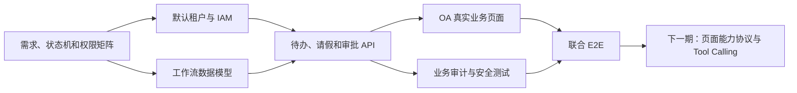

# AI WorkMate 一期实施与工期预估

## 1. 文档信息

| 项目 | 内容 |
| --- | --- |
| 阶段名称 | Phase 1：企业权限完善与请假审批真实闭环 |
| 优先级 | P0 |
| 当前状态 | 待评审 |
| 编制日期 | 2026-07-27 |
| 前置阶段 | Phase 0 已完成 |
| 目标版本 | 一期 |

本文档用于一期范围评审、人力安排、工期估算和验收。人日为当前仓库基础上的工程估算，不包含需求长期等待、外部系统采购、生产数据治理和第三方审批流程对接时间。

## 2. 一期目标

一期不追求一次性建设完整 OA，而是完成第一个真实、可鉴权、可审计、可测试的企业业务闭环：

> 员工创建请假草稿并提交，系统生成审批待办，审批人完成通过或退回，员工可以查看结果和审批时间线。

同时完善该闭环依赖的身份、组织、角色、数据隔离与业务审计基础，为后续 Page Capability、AI Tool Calling、RAG 和更多 OA 领域提供可信的领域服务。

## 3. 已确认架构决策

### 3.1 租户策略

一期采用：

> 默认单租户运行，但数据库和后端预留并强制执行 `tenant_id` 隔离。

具体规则：

- 初始化一个默认租户，所有现有用户和一期业务数据归属该租户。
- 核心业务表必须包含 `tenant_id`，并建立必要的组合索引和唯一约束。
- `tenantId` 只能从服务端认证上下文解析，禁止信任请求体、查询参数或前端状态传入的租户身份。
- 用户、权限、工作流、会话、附件、知识文档和审计查询均必须校验租户边界。
- 一期不建设租户注册、套餐、计费、独立域名和租户自助开通能力。
- 一期不在前端提供自由切换租户的入口。
- 后续升级为 SaaS 多租户时，不应再进行核心业务表的大规模租户字段补录。

### 3.2 工作流策略

- 一期采用固定单级审批。
- 每个员工配置一个有效审批人，或按部门配置默认审批人。
- 不建设可视化流程设计器。
- 不实现条件分支、会签、或签、加签、转办和委托。
- 审批状态由确定性代码控制，不交给 AI 或前端决定。

### 3.3 请假策略

- 支持保存草稿、编辑草稿、提交、查看、撤回、通过和退回。
- 一期支持按天或半天填写请假时间。
- 一期不接入法定节假日、考勤打卡和复杂假期余额计算。
- 一期不上传医疗证明等附件；如纳入范围需单独增加估时。

### 3.4 AI 能力边界

- 一期不开放 AI 自动提交请假或执行审批。
- `/api/ai/tasks/plan` 与 `/api/ai/tasks/execute` 在没有真实工具时继续明确返回能力不可用。
- 一期建立的领域 Service 必须可被下一期 Tool Calling 复用。
- 不允许为了演示返回 mock 成功。

## 4. 一期范围

### 4.1 IAM、组织与数据隔离

数据库建设：

- `tenant`
- `department`
- `position`
- `user_role`
- `role_permission` 沿用并完善现有结构
- `data_scope`
- 用户与默认租户、部门、岗位的关联
- 权限版本字段及必要索引

后端能力：

- 根据认证 `userId` 解析当前租户、用户、角色、权限和数据范围。
- 支持一个用户拥有多个角色。
- 角色或权限变更后，使权限缓存主动失效。
- 每次敏感操作执行前重新校验当前有效权限。
- 保证最后一名有效 `SUPER_ADMIN` 不可被降级或停用。
- 查询和写入统一附加租户边界。

前端能力：

- 权限后台支持用户多角色分配。
- 支持维护用户所属部门、岗位和审批人。
- 菜单和页面访问继续使用服务端动态导航。
- 真实业务按钮依据服务端权限展示，但后端仍是最终授权方。
- 本地 mock 角色只保留在明确的开发演示区域，不参与真实授权。

### 4.2 工作流最小模型

建议数据表：

- `workflow_definition`
- `workflow_instance`
- `workflow_task`
- `workflow_action_log`
- `leave_application`
- `business_audit_log`

核心字段要求：

- 所有业务表包含 `tenant_id`。
- 流程实例关联业务类型和业务记录 ID。
- 待办包含受理人、状态、到期时间和乐观锁版本。
- 请假申请包含申请人、时间范围、类型、原因、状态和版本。
- 写操作包含创建时间、更新时间和必要的唯一约束。
- 审计记录包含 actor、tenant、resource、action、result 和 traceId。

建议状态：

```text
DRAFT -> PENDING -> APPROVED
                 -> REJECTED
PENDING -> WITHDRAWN
```

约束：

- 草稿只能由申请人编辑。
- 只有 `PENDING` 状态可以审批。
- 只有当前任务受理人可以通过或退回。
- 同一审批任务并发提交时只有一次成功。
- 已审批申请不能再次审批。
- 申请人不能审批自己的申请。
- 撤回后不得继续处理原审批任务。

### 4.3 后端 API

建议一期接口：

#### 我的待办

- `GET /api/todos`
- `GET /api/todos/{id}`

#### 请假申请

- `POST /api/leave-applications`
- `PUT /api/leave-applications/{id}`
- `GET /api/leave-applications/{id}`
- `GET /api/leave-applications/mine`
- `POST /api/leave-applications/{id}/submit`
- `POST /api/leave-applications/{id}/withdraw`

#### 审批

- `POST /api/approval-tasks/{id}/approve`
- `POST /api/approval-tasks/{id}/reject`
- `GET /api/approval-tasks/{id}/timeline`

#### 审计

- `GET /api/audit-records`

接口统一要求：

- 使用请求 DTO、响应 DTO 和 Bean Validation。
- 使用统一 `Result<T>` 和稳定错误码。
- 认证失败返回 401，权限不足返回 403。
- 状态或版本冲突返回 409。
- 所有资源查询同时校验 `tenant_id`、用户权限和资源归属。
- 写操作具备事务、幂等或乐观锁保护。
- 日志和响应保留 requestId/traceId。

### 4.4 OA 前端页面

一期新增或替换以下真实页面：

1. **我的待办**
   - 分页、状态和时间筛选。
   - 展示申请人、类型、提交时间、当前状态和是否超时。
   - 点击进入真实审批详情。

2. **请假申请**
   - 使用 Ant Design `Form`。
   - 支持请假类型、起止时间、半天选择和请假原因。
   - 支持保存草稿和提交。
   - 提交前展示确认信息。

3. **我的申请**
   - 查看草稿、审批中、已通过、已退回和已撤回记录。
   - 草稿可以继续编辑。
   - 审批中申请在满足规则时可以撤回。

4. **审批详情**
   - 展示申请信息和当前状态。
   - 使用 `Modal` 收集通过或退回意见。
   - 防止重复点击和重复请求。

5. **审批时间线**
   - 使用 Ant Design `Timeline` 展示提交、审批、退回和撤回记录。

6. **审计中心最小页面**
   - 按操作人、动作、资源类型、结果和时间查询。
   - 普通员工不可访问全局审计。

页面必须处理：

- 加载状态
- 空状态
- 请求失败
- 401/403
- 409 状态冲突
- 重复提交
- 移动端布局
- 路由、侧栏选中态和顶部标签同步

### 4.5 测试与工程保障

后端测试：

- Service 状态机单元测试。
- Controller 参数和权限测试。
- PostgreSQL 集成测试。
- 跨用户和跨租户越权测试。
- 并发审批和重复请求测试。
- 最后一名超级管理员保护测试。
- `init.sql` 空库执行和重复执行测试。

前端测试：

- API 客户端错误映射测试。
- 请假表单和审批按钮权限测试。
- 路由无权限跳转测试。
- 至少一条关键 E2E：登录、提交请假、审批、查看结果。

工程要求：

- `fronted-main` 执行 `npm run lint` 和 `npm run build`。
- `fonted-oa` 执行 `npm run lint` 和 `npm run build`。
- 后端使用 Java 17 执行 `mvn test`。
- CI 环境固定 Java 17
- 所有数据库结构变更继续合并到唯一入口 `backend/src/main/resources/db/init.sql`。

## 5. 明确不在一期范围

- 租户注册、套餐、计费、域名和租户切换。
- 可视化流程设计器。
- 多级审批、条件审批、会签、转办和委托。
- 假期余额、法定节假日和考勤联动。
- 企业微信、钉钉、飞书和邮件审批通知。
- AI 自动提交、自动审批和批量审批。
- Page Capability Manifest 与 UI Command。
- AI Tool Registry 和 Task Engine。
- RAG 企业知识库。
- 多模型路由和多 Agent。
- 财务、合同、资产等其他业务域。
- MinIO/S3、病毒扫描和附件异步解析生产化。

范围外需求如在一期实施，必须重新评估工期和验收门禁。

## 7. 建议里程碑

### M1：需求与数据基线

目标：

- 状态机、权限矩阵和 API 契约评审通过。
- 默认租户、组织、多角色和 `tenant_id` 数据结构完成。
- 现有数据具备安全的默认租户归属。

建议周期：第 1 周。

### M2：后端业务闭环

目标：

- 请假草稿、提交、待办生成、通过、退回和撤回可通过 API 完成。
- 权限、租户、资源归属、乐观锁和业务审计有效。

建议周期：第 2～3 周。

### M3：OA 页面闭环

目标：

- 员工完成申请和结果查询。
- 审批人完成待办处理。
- 路由、菜单、按钮权限和错误状态正确。

建议周期：第 3～4 周。

### M4：安全与联合验收

目标：

- 跨用户、跨租户、并发和重复提交测试通过。
- 完成真实 PostgreSQL E2E。
- 两个前端 lint/build 和后端测试通过。
- 输出交付记录、已知风险和下一期输入。

建议周期：第 5～6 周。

## 8. 依赖关系



## 9. 验收标准

一期只有同时满足以下条件才算完成：

- 默认租户能够正常运行，核心业务数据全部带 `tenant_id`。
- 修改请求体、URL 或记录 ID 不能跨用户或跨租户访问。
- 员工只能查看和修改自己的请假申请。
- 审批人只能处理分配给自己的待办。
- 普通员工不能访问权限后台和全局审计。
- 请假提交后生成唯一有效待办。
- 同一审批任务并发处理时只有一次成功。
- 通过、退回和撤回都产生完整业务时间线。
- 每次业务写入都有 actor、tenant、resource、action、result 和 traceId。
- 页面数据来自真实后端接口，不使用 fallback mock 伪造成功。
- 两个前端应用 lint/build 通过。
- 后端 Java 17 测试通过。
- PostgreSQL 空库初始化和重复执行 `init.sql` 通过。
- staging 环境完成“员工提交—审批人处理—员工查看结果”E2E。

## 10. 主要风险

| 风险 | 影响 | 控制措施 |
| --- | --- | --- |
| 一期加入复杂流程配置 | 工期明显扩大 | 固定单级审批，复杂流程后移 |
| `tenant_id` 只加字段但不校验 | 产生跨租户数据泄露 | 服务端认证上下文统一注入并增加越权测试 |
| 继续依赖前端 mock 权限 | 页面表现与真实权限不一致 | 真实链路只使用后端导航和权限结果 |
| 并发审批重复执行 | 产生错误业务状态 | 乐观锁、状态条件更新和幂等约束 |
| 现有用户无租户归属 | 升级后无法登录或查询 | `init.sql` 提供默认租户和兼容数据回填 |
| 审计保存敏感内容 | 隐私与合规风险 | 只保存必要摘要并进行脱敏 |
| 本机默认 Java 8 | 后端测试无法运行 | 启动脚本和 CI 显式使用 Java 17 |
| 前端页面范围持续扩张 | 挤压核心闭环时间 | 一期只实现待办、请假、审批和最小审计 |

## 11. 评审时需要最终确认

- 默认租户的名称和编码。
- 部门默认审批人还是员工直属审批人。
- 请假按天还是支持半天。
- 是否允许审批中的申请撤回。
- 退回后是结束流程，还是允许修改后重新提交。
- 审批意见是否必填。
- 是否需要站内通知；默认建议一期不做。
- 是否需要请假附件；默认建议一期不做。
- 一期团队人员配置和期望上线日期。

## 12. 下一期输入

Phase 1 验收后，建议进入 Phase 2：

1. 为 Dashboard、待办、请假和审批详情建立 Page Capability Manifest。
2. 建立 Context Snapshot、UI Command Validator 和 Command Bus。
3. 支持 AI 导航、筛选、打开详情、填写请假草稿和表单校验。
4. UI Command 不直接执行提交或审批。
5. 协议稳定后，再进入受控 Tool Calling 与任务引擎建设。

