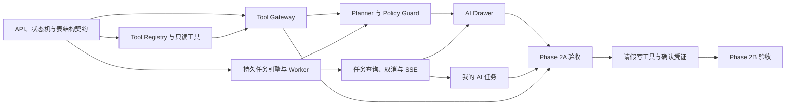

# AI WorkMate 二期（Agent）实施与工期预估

## 1. 文档信息

| 项目 | 内容 |
| --- | --- |
| 阶段名称 | Phase 2：AI Tool Calling 与受控任务执行 |
| 优先级 | P0 |
| 当前状态 | 评审修订版，待范围与排期确认 |
| 编制日期 | 2026-08-10 |
| 最近修订 | 2026-08-10 |
| 前置阶段 | Phase 0（基线）与 Phase 1（权限、工作流、请假审批闭环）已完成；RAG 知识库与 SSE 聊天已真实上线 |
| 目标版本 | 二期，拆分为 Phase 2A（只读闭环）与 Phase 2B（写操作试点）两个发布门 |

本文档用于二期范围评审、Vibe Coding 编排、工期估算和验收。工期按“一名人工负责人持续使用 Codex/AI 编码协作”的有效工作日估算，不按传统纯人工人日换算；需求等待、环境故障、生产数据治理和第三方集成时间不计入。

强制安全附件：`docs/roadmap/phase-2-agent-security-boundary.md`。安全附件中的永久禁止能力、自治等级、运行上限、Kill Switch 和发布门不得被 Prompt、数据库配置、租户配置或角色权限覆盖。

Tool Gateway 架构：`docs/architecture/agent-tool-gateway.md`。所有 Agent 工具执行必须遵循其中的唯一入口、最小入参、防绕过和纵深鉴权设计。

## 2. 二期目标

二期把 OA 中尚为占位的 AI plan/execute 链路建设成企业级受控 Agent 能力，完成第一个真实闭环：

> 用户用自然语言发起任务（例如“查一下我未处理的待办”），服务端从认证上下文解析用户权限和数据范围，模型生成候选步骤，策略层复核后由任务引擎确定性执行白名单工具，全程可鉴权、可确认、可审计、可幂等、可恢复、可观测。

同时完成 Tool Registry、Tool Gateway、持久任务状态机、异步执行、确认机制、审计与失败分类，为后续更多写操作工具、UI Command 协议和多 Agent 提供可信执行底座。

二期以“单 Copilot + 确定性工具执行”为主，严格遵循：

> AI 的能力上限始终等于当前用户在当前租户、当前数据范围内的能力上限；模型输出永远不是授权或可直接执行的指令。

Phase 2A 的自治等级上限为 A1 受控只读；Phase 2B 上限为 A2 单一受控写入。Phase 2 不允许循环规划、递归调用、后台自治、多个写步骤或 Agent 自行创建和修改工具。

## 3. 已确认架构决策

### 3.1 工具接入方式

- 采用服务端 Tool Registry + Policy Guard + Tool Gateway + 确定性执行引擎，不直接依赖模型 provider 的原生 function calling 回调执行工具。
- 模型只负责理解目标和生成结构化候选计划；参数、输出、权限、数据范围、风险、确认、幂等、事务和审计均由代码控制。
- 工具实现直接复用既有领域 Service（LeaveWorkflow、Knowledge、Notification 等），禁止 AI 层复制业务规则或直接调用 Mapper。
- 未接真实工具的页面继续返回 `AI_TASK_CAPABILITY_UNAVAILABLE`，禁止 fallback mock。
- 代码中的 handler 与安全元数据是工具定义的权威来源；数据库只保存启用配置、租户覆盖和可查询快照，禁止仅修改数据库就降低风险等级或绕过权限。
- 计划固化 `toolVersion` 与 `schemaHash`；执行前版本不一致时拒绝执行并要求重新规划。
- Tool Gateway 是 Agent 工具调用的唯一执行入口。Worker 只能提交服务端 stepId 和租约，不能直接取得 handler，也不能提交或覆盖身份、权限、toolCode、args 和风险信息。
- Tool Gateway 是模块化单体内的进程内安全边界，不开放公共 HTTP 接口；浏览器、模型和外部系统均不能直接调用。

### 3.2 风险分级与确认

| 等级 | 范围 | 确认策略 |
| --- | --- | --- |
| L0 只读 | 查询、检索、分析 | 可由用户点击“执行”或按产品配置自动排队；无需确认凭证，但必须审计 |
| L1 低风险写 | 保存本人草稿等可恢复操作 | 展示计划和影响范围，用户明确确认后执行 |
| L2 受控高风险写 | Phase 2B 仅允许提交本人已存在的有效请假草稿 | 二次确认 + 一次性确认凭证 + 实时鉴权 + 审计 |
| DENY 永久禁止 | 审批、删除、权限修改、批量操作、敏感导出、外部消息及安全附件列出的通用能力 | 不可通过确认、角色或配置解除 |

- 确认凭证绑定 taskId、userId、tenantId、planVersion、planHash 与过期时间。
- 数据库只存凭证哈希，不存可重放明文；消费凭证与 `WAITING_CONFIRMATION -> QUEUED` 状态迁移必须在一次条件更新中原子完成。
- L1/L2 由用户在确认 UI 中明确操作后，再调用独立凭证接口签发随机 confirmationToken；数据库只保留其哈希，前端只保存在当前内存状态，禁止写入日志或 localStorage。重新签发时原凭证立即失效，接口需限流。
- 计划内容、用户权限、资源归属或工具版本发生变化时，旧凭证立即失效并要求重新规划。
- 普通员工不得执行审批、删除、权限修改、敏感导出等高风险动作；本人请假提交仍需依据实时 `leave:create` 权限和资源归属判断。

### 3.3 任务模型与执行语义

- 任务持久化到 PostgreSQL，状态机由确定性代码控制，不允许 LLM 决定状态。
- plan 与 execute 使用独立的幂等操作域。幂等唯一范围为 `tenantId + userId + operation + idempotencyKey`，并记录 `requestHash`。
- 相同幂等键且请求哈希相同，返回原任务；请求哈希不同，返回 `IDEMPOTENCY_CONFLICT`。
- 任务级防重复不能代替领域副作用幂等；写工具仍必须使用业务状态条件更新或领域幂等键。
- execute 只负责校验并将任务原子排队，实际工具执行由事务提交后的异步 Worker 完成，不占用模型请求或 Controller 事务。
- Worker 使用领取租约和心跳，服务重启后可以重新领取超时任务；非幂等写工具禁止自动重试。
- Worker 不调用 ToolHandler；它只将 stepId 和当前租约交给 Tool Gateway，由网关重新加载持久快照、做最终安全决策并分派固定 handler。
- 长任务通过独立 SSE 端点推送进度；列表和详情接口始终可查询持久化快照。

### 3.4 多租户、数据与 Prompt 安全边界

- 任务、步骤、事件与工具调用全部从认证上下文解析 userId/tenantId，禁止信任请求体、JWT 中历史角色或前端权限声明。
- 每次规划、确认、执行、查询、取消和订阅事件均按 tenantId + userId 校验任务所有权。
- 工具参数中的资源 ID 在服务端二次校验归属、租户和实时数据范围；计划生成后权限被回收时，执行必须失败。
- `pageContext` 是不可信输入，服务端按 pageId 使用字段白名单、长度、嵌套深度和总大小限制重新过滤，不能依赖前端“已脱敏”声明。
- 知识检索内容和工具结果均视为不可信数据，不得把其中的指令提升为系统指令或工具调用授权。
- input、pageContext、args、result 和错误信息需定义留存期限与脱敏策略；日志与审计只记录必要摘要或哈希，不记录完整 prompt、知识正文、JWT 或密钥。

### 3.5 Agent 能力硬上限

- 永久禁止任意 SQL、代码执行、文件系统、任意 URL、外部消息、权限修改、删除、批量操作、敏感导出和后台定时自治能力。
- 永久禁止清单高于 `SUPER_ADMIN` 权限，不能通过二次确认解除。
- Phase 2B 一个任务最多一个写步骤；`leave.createDraft` 与 `leave.submit` 不得出现在同一计划中。
- 工具 schema 禁止 userId、tenantId、role、permission、dataScope、URL、SQL、文件路径、脚本和动态 class/bean 名称字段。
- 工具输出、RAG 内容和页面文本不能递归触发工具调用。
- 默认限制计划步骤、工具次数、查询条数、结果大小、并发任务、请求频率和执行时间；具体默认值以安全附件为准，租户只能收紧。
- 提供全局、规划、执行、写工具、租户和单工具 Kill Switch；权限、策略或审计组件异常时 fail closed。
- Controller、Planner、Task Service、Worker 和普通业务组件不得绕过 Tool Gateway 直接调用 ToolHandler；使用 ArchUnit 或等价架构测试固化包依赖规则。

## 4. 二期范围

### 4.1 Tool Registry（工具注册表）

数据库建设：

- `agent_tool`：id、tenant_id、code、name、description、handler_version、parameters_schema、output_schema、schema_hash、risk_level、required_permissions、permission_mode、data_scope_policy、idempotent、retry_policy、timeout_ms、audit_level、enabled、created_at、updated_at。
- 使用 JSONB 保存 schema；平台默认工具使用 `tenant_id IS NULL`，分别建立 `UNIQUE(code) WHERE tenant_id IS NULL` 与 `UNIQUE(tenant_id, code) WHERE tenant_id IS NOT NULL` 部分唯一索引，避免 PostgreSQL 的 NULL 语义产生重复平台工具；租户配置只能收窄或关闭平台能力。
- 风险等级、handlerVersion、权限策略和 schema 由代码注册信息校验，数据库配置不得扩大代码声明的能力。
- 工具白名单 = 代码已注册 ∩ 平台启用 ∩ 租户启用 ∩ 用户实时权限 ∩ 页面允许能力。
- `route:<page>` 仅表示页面访问权限，不能代替 `todo:read`、`leave:create` 等业务动作权限。

后端能力：

- `ToolRegistry`：注册、查询、按 code + tenant 装载工具定义与 handler，启动时校验重复 code、schema 和版本。
- `ToolHandler`：`execute(context, args)` 返回结构化结果；禁止 handler 信任 args 中的 userId/tenantId。
- 输入先经过 JSON Schema 校验，再执行类型、枚举、长度、分页上限、资源归属等领域校验。
- 工具返回值必须通过 outputSchema、大小上限和敏感字段过滤，再写任务结果或提供给模型总结。
- 成功写操作和所有被拒绝的敏感调用均写入 `business_audit_log`；审计内容不得包含完整敏感参数。

Phase 2A 首批工具（全部只读，L0）：

| code | 能力 | 复用服务 | 业务权限 |
| --- | --- | --- | --- |
| `todo.query` | 我的待办分页、状态、时间查询 | LeaveWorkflow Service 的待办能力 | `todo:read` |
| `leave.mine` | 我的请假申请列表与详情 | LeaveWorkflow Service | `leave:read:self` |
| `knowledge.search` | 知识库权限化检索，结果带引用 | Knowledge Service + RAG 链路 | 复用知识库实时访问策略 |
| `notification.mine` | 我的站内通知分页查询 | Notification Service | 登录用户，仅限本人 |

### 4.2 Tool Gateway（工具安全网关）

Tool Gateway 位于 Worker 与 ToolHandler 之间，是 Agent 执行路径的唯一策略执行点：

```text
Worker(stepId + lease)
        ↓
ToolGateway
  ├─ Kill Switch / 限流 / 预算
  ├─ task/step/lease/attempt 状态校验
  ├─ planHash/toolVersion/schemaHash/argsHash 防篡改
  ├─ 实时用户、租户、权限和数据范围
  ├─ 永久禁止清单、风险、确认和单写步骤限制
  ├─ inputSchema 与资源归属预检
  └─ 前置 ALLOW/DENY 审计（失败即关闭）
        ↓
固定 ToolHandler
        ↓
领域 Service 再鉴权与业务状态校验
        ↓
outputSchema / 脱敏 / 限量 / 结果审计
```

关键约束：

- 网关入参只接受 stepId 和 Worker lease，不接受客户端或模型提供的身份、toolCode、args、风险、权限或确认状态。
- 网关从 PostgreSQL 重新加载 task/step 不可变快照，并校验 RUNNING 状态、当前 attempt、workerId、leaseUntil 和所有哈希。
- 所有授权结论仅对当前 task + step + attempt + lease 有效，不能跨任务复用或长期缓存。
- 网关持有唯一 handler 映射；禁止通用 `execute(toolCode, args, userId)`、管理员代执行和工具测试执行接口。
- 网关通过后，领域 Service 仍必须校验 tenantId、owner/assignee、实时权限与业务状态，网关不能替代领域鉴权。
- Registry、Policy、权限、限流或前置审计异常时返回 `UNAVAILABLE` 并 fail closed；不得 fallback 直调 handler。
- 网关决策分为 ALLOW、DENY、STALE、THROTTLED、UNAVAILABLE，客户端只得到稳定错误码，不得到内部策略和安全配置细节。
- handler 包只允许 Tool Gateway 依赖；通过 ArchUnit 或等价测试阻止 Planner、Controller、Task Service 和 Worker 直接注入 handler。

数据库增加 `agent_tool_invocation`：id、tenant_id、user_id、task_id、step_id、attempt、decision_id、tool_code、tool_version、plan_hash、args_hash、decision、deny_reason、trace_id、latency_ms、started_at、finished_at。该表用于追加式网关决策与调用审计，禁止 Agent 修改或删除。

### 4.3 任务、步骤与事件模型

数据库建设：

- `agent_task`：id、task_no、user_id、tenant_id、conversation_id、page_id、input、page_context、plan、plan_hash、plan_version、max_risk_level、status、operation、idempotency_key、request_hash、confirmation_token_hash、confirmation_expires_at、confirmed_at、confirmation_consumed_at、timeout_at、worker_id、lease_until、heartbeat_at、attempt_count、started_at、finished_at、error_code、error_message、version、created_at、updated_at。
- `agent_task_step`：id、task_id、seq、tool_code、tool_version、schema_hash、args、status、attempt_count、result、result_summary、error_code、error_message、timeout_at、trace_id、started_at、finished_at。
- `agent_task_event`：id、task_id、event_type、payload、created_at，用于 SSE 断线续传与进度审计；payload 只保存可对当前用户展示的脱敏信息。
- 至少包含：`task_no` 唯一约束、`(tenant_id,user_id,operation,idempotency_key)` 唯一约束、`(task_id,seq)` 唯一约束、状态与风险等级 CHECK、必要外键，以及用户任务列表、Worker 领取、过期清理索引。
- 所有新表、索引和种子数据必须新增 `backend/src/main/resources/db/migration/V*__*.sql` Flyway 迁移；禁止继续向历史 `init.sql` 追加结构变更，也禁止修改已发布迁移。

状态机：

```text
RECEIVED -> PLANNING
PLANNING -> PLAN_READY | REJECTED

PLAN_READY -> QUEUED                         # L0
PLAN_READY -> WAITING_CONFIRMATION           # L1/L2
WAITING_CONFIRMATION -> QUEUED                # 原子确认并消费凭证
WAITING_CONFIRMATION -> EXPIRED | CANCELLED

QUEUED -> RUNNING | CANCELLED
RUNNING -> SUCCEEDED | PARTIALLY_SUCCEEDED | FAILED | TIMED_OUT
```

Phase 2 不实现通用补偿状态机。每个写工具必须在定义中声明幂等与重试策略；无法安全重试的部分成功任务进入 `PARTIALLY_SUCCEEDED` 并提示人工处理。后续存在真实可补偿工具时，再引入 Saga/Compensation 状态。

关键约束：

- 所有流转使用状态 + version 条件更新；并发确认、领取、取消只能有一个成功。
- Worker 领取时写入 workerId、leaseUntil 和 heartbeatAt；租约过期后按工具重试策略恢复。
- L0 是否自动排队由产品配置决定，API 契约必须明确；默认由用户点击“执行”，避免查询成本和误触发。
- 清理任务只处理确认过期、运行超时和过期事件，不替代 Worker 的实时超时与取消处理。

### 4.4 API 协议

`POST /api/ai/tasks/plan`：

1. 认证并实时解析 userId、tenantId、角色、权限和数据范围。
2. 校验 `Idempotency-Key`、input、pageId 和 pageContext；服务端过滤 pageContext。
3. 按页面能力和权限计算可用工具白名单，只把必要的工具描述和 schema 注入模型。
4. 模型生成结构化候选计划，解析失败最多重试 1 次，仍失败则确定性拒绝。
5. Policy Guard 逐步骤复核工具版本、schema、权限、数据范围和风险；不允许把非法工具“降级”为另一个有副作用工具。
6. 保存任务、步骤、planHash 和工具版本快照。
7. 返回 taskId、status、steps、影响范围、riskLevel、confirmationRequired、planVersion、planHash、expiresAt；plan 不签发 confirmationToken。

`POST /api/ai/tasks/{taskId}/confirmation-token`：

1. 仅用于处于 WAITING_CONFIRMATION 的 L1/L2 任务，且必须由确认 UI 的明确用户操作触发。
2. 校验 JWT、任务所有权、planVersion、planHash、实时权限、资源归属和工具版本。
3. 签发短期一次性 token，数据库仅保存哈希和过期时间；重新签发时原 token 失效。
4. 返回 confirmationToken 与 expiresAt；端点按 userId + taskId 限流并写安全审计。

`POST /api/ai/tasks/{taskId}/execute`：

1. 校验 JWT、任务所有权、`Idempotency-Key`、planVersion 与 planHash。
2. 重新校验用户权限、资源归属、工具启用状态、工具版本和 schemaHash。
3. L1/L2 校验一次性 confirmationToken；原子消费凭证并迁移到 QUEUED。L0 直接从 PLAN_READY 迁移到 QUEUED。
4. 返回 `202 Accepted`：taskId、status、statusUrl、eventsUrl，不同步等待最终结果。

任务查询与控制：

- `GET /api/ai/tasks`：只查询当前用户任务，支持状态、时间和分页过滤。
- `GET /api/ai/tasks/{taskId}`：返回任务快照、步骤摘要和最终结果。
- `POST /api/ai/tasks/{taskId}/cancel`：仅允许取消当前用户处于可取消状态的任务。
- `GET /api/ai/tasks/{taskId}/events`：SSE 事件流，支持 `Last-Event-ID`，事件类型至少包含 snapshot、step-started、step-completed、task-completed、task-failed、heartbeat。
- SSE 流中错误按当前 locale 输出；断线后客户端先查询快照，再从最后 eventId 续传。

兼容策略：现有 `POST /api/ai/tasks/execute` 在前后端同一次发布中迁移到 taskId 路径接口，不保留伪成功兼容层。

### 4.5 前端升级（fonted-oa）

- AI Drawer 展示真实计划步骤、工具名、参数脱敏摘要、影响范围和风险等级；确认后按需签发 confirmationToken，并只保存在 Drawer 当前内存状态，关闭或刷新后重新签发。
- L0 显示“执行”按钮；L1/L2 显示明确确认按钮，L2 使用 Ant Design `Modal.confirm` 二次确认。
- execute 收到 202 后订阅 SSE，断线时查询任务快照并按 lastEventId 重连；终态后停止重连。
- 能力不可用、越权、计划过期、权限变化、确认过期、幂等冲突等按真实错误码渲染，禁止 fallback mock。
- 新增“我的 AI 任务”页面：Ant Design Table 列表、步骤详情、终态结果、失败原因和可取消操作；入口通过新的 Flyway 迁移写入服务端动态路由。
- 新增所有可见文案必须同步 `zh-CN` 与 `en-US`，并使用 OaIcon 语义图标。

### 4.6 观测、审计与数据治理

- 任务级记录 requestId、conversationId、plannerModel、promptVersion、计划延迟、token 估算、总工具调用次数和 traceId。
- 步骤级记录 toolCode、toolVersion、attempt、latency、traceId、结果摘要和错误分类；模型指标不重复写到每个步骤。
- 失败分类至少包括：AUTH_FAILED、PERMISSION_DENIED、RESOURCE_SCOPE_DENIED、RETRIEVAL_EMPTY、MODEL_TIMEOUT、SCHEMA_INVALID、TOOL_VERSION_CHANGED、TOOL_TIMEOUT、TOOL_FAILED、CONFIRMATION_EXPIRED、IDEMPOTENCY_CONFLICT、TASK_TIMEOUT、BUDGET_EXCEEDED、GATEWAY_DENIED、GATEWAY_STALE、GATEWAY_THROTTLED、GATEWAY_UNAVAILABLE。
- 明确任务输入、计划、步骤参数、结果和事件的保留期限、清理方式与人工导出边界。
- 安全拒绝、确认重放、非法 schema、越权资源访问和幂等冲突必须形成审计记录。
- 每次 Tool Gateway 调用记录 decisionId、task/step/attempt、工具版本、决策、拒绝分类、traceId 和耗时；前置 ALLOW 审计成功后才允许调用 handler。

## 5. 分阶段范围

### Phase 2A：只读可信闭环

- 四个 L0 工具。
- Tool Registry、Policy Guard、Tool Gateway、持久状态机、数据库队列 Worker、SSE、任务查询和取消。
- AI Drawer 与“我的 AI 任务”页面。
- 权限、越权、并发、重启恢复、SSE 重连和安全审计验收。

### Phase 2B：写操作试点

- `leave.createDraft`（L1）与 `leave.submit`（L2）。
- 两个写工具只能分别用于独立任务，禁止在一个计划中创建后立即提交。
- 原子确认凭证、领域状态幂等、写审计和人工介入提示。
- Phase 2A 验收通过后才允许启用写工具；配置可按租户关闭。

## 6. 明确不在二期范围

- 多 Agent 协作与跨领域长任务编排。
- UI Command 协议与 Page Capability Manifest。
- 可视化工具编排、流程设计器。
- 企业微信、钉钉、飞书、邮件等外部集成工具。
- 模型供应商自动路由与多模型切换。
- 任务计费和成本治理平台；但必须有输入大小、分页、步骤数、超时等运行安全上限。
- 通用 Saga 补偿引擎。
- 微服务拆分；继续采用模块化单体，按 `agent` 域分包。

## 7. Vibe Coding 里程碑与工期

| 里程碑 | 目标 | Vibe Coding 有效工作日 |
| --- | --- | ---: |
| M0 安全与契约冻结 | 安全附件、状态机、API、表结构和硬上限评审通过 | 1~2 天 |
| M1 工具注册与只读工具 | Tool Registry、Policy Guard 骨架与 4 个 L0 工具 | 2~3 天 |
| M2 Tool Gateway | 唯一执行入口、决策审计、实时权限、输入输出防线和防绕过架构测试 | 2~3 天 |
| M3 持久任务引擎 | 状态机、Worker 租约、幂等、任务查询/取消、SSE 续传 | 4~6 天 |
| M4 Planner、Policy Guard 与 API | 结构化计划、上下文过滤、策略复核、任务 API 与攻击用例 | 3~4 天 |
| M5 Phase 2A 前端闭环 | AI Drawer、任务记录页、真实错误态和断线恢复 | 2~3 天 |
| M6 Phase 2A 安全发布门 | 越权、网关绕过、注入、并发、重启、Kill Switch 和人工验收 | 2~3 天，不得压缩 |
| M7 Phase 2B 写操作试点 | 两个独立请假写工具、确认凭证、领域幂等和网关安全验收 | 2~3 天 |
| M8 观测、治理与文档 | 观测、审计、数据清理、规则和架构文档同步 | 1~2 天，贯穿执行 |

总量按 19~29 个 Vibe Coding 有效工作日估算，其中代码生成和测试骨架可以并行，但 Tool Gateway、数据库约束、鉴权、确认、幂等、Worker 领取 SQL 与安全发布门必须由人工逐项评审。建议安排 5~7 个自然周，Phase 2A 与 Phase 2B 分两次发布；不得因为 AI 已生成代码而跳过网关防绕过测试、失败路径测试或安全门。

## 8. 依赖关系



## 9. 验收标准

### Phase 2A

- 四个只读工具返回真实业务数据，不使用 mock。
- 普通员工可以执行有权限的 L0 工具，管理员角色硬编码不得代替工具级权限。
- 越权工具、跨租户、跨用户资源访问被拒绝并产生脱敏审计。
- 相同幂等键和请求哈希返回原任务；同键不同请求返回冲突。
- 工具输入和输出 schema 非法时返回可解释错误，不向模型或客户端暴露堆栈。
- plan 后权限、资源归属、工具版本发生变化时 execute 拒绝并要求重新规划。
- 并发 execute 只领取一次；服务在 RUNNING 状态重启后任务按策略恢复或进入可解释终态。
- SSE 具备心跳、终态、错误事件与断线续传；只能订阅本人任务。
- 任务列表、详情、取消接口均校验当前 userId + tenantId。
- LLM 无原始 SQL、任意 URL、文件或脚本执行能力；知识内容中的提示注入不能扩大工具权限。
- 未知 toolCode、未知字段、类型混淆、恶意嵌套和超过运行预算的计划全部 fail closed。
- 永久禁止能力不能通过 Prompt、数据库配置、租户配置、`SUPER_ADMIN` 或二次确认解除。
- 全局、执行、写工具、租户和单工具 Kill Switch 均经过演练；权限、策略或审计依赖异常时不继续执行。
- 所有 Agent 工具调用均经过 Tool Gateway；Controller、Planner、Worker 和其他 Service 直接调用 ToolHandler 的架构测试必须失败。
- 伪造 stepId、Worker 租约、attempt、planHash、argsHash、toolVersion 或过期授权时，网关拒绝且 handler 调用次数为 0。
- 网关 ALLOW 之后领域 Service 仍执行租户、资源归属、实时权限和业务状态校验，证明网关不会成为唯一且脆弱的鉴权点。

### Phase 2B

- 含写步骤的计划未确认不执行；凭证过期、重复使用、planVersion/planHash 不匹配均被拒绝。
- `leave.createDraft` 仅能创建本人草稿；`leave.submit` 仅能提交本人当前有效草稿。
- 一个任务最多一个写步骤；createDraft 与 submit 不得进入同一计划。
- 重复 execute 和 Worker 重试不会产生第二份草稿或重复提交。
- 写操作成功、失败、拒绝和确认重放均有业务/安全审计。

### 工程验证

- 新增 Flyway 迁移在 PostgreSQL 空库首次迁移、已有库升级和迁移后重启三种场景通过；`init.sql` 仅用于历史基线参考，不追加 Phase 2 结构。
- 后端 Java 17 `mvn test` 通过，覆盖状态机、越权、幂等、确认、Worker 恢复、schema 和 SSE 所有权。
- 两个前端 `npm run lint`、`npm run build` 通过；`fonted-oa` Vitest 通过。
- `zh-CN` 与 `en-US` 下错误响应、SSE 错误事件和 OA 页面无硬编码文案或 key 暴露。
- 未接真实工具或 LLM 时仍返回 `AI_TASK_CAPABILITY_UNAVAILABLE`。

## 10. 主要风险

| 风险 | 影响 | 控制措施 |
| --- | --- | --- |
| LLM 输出格式不稳定 | 计划解析失败 | 结构化输出 + schema 校验 + 最多一次重试 + 确定性拒绝 |
| Prompt Injection | 模型尝试选择未授权工具 | 系统指令与不可信数据隔离；只暴露白名单；代码再次校验 |
| 工具授权放大 | 越权数据泄露 | 实时权限交集 + 资源归属二次校验 + 执行前复核 |
| 绕过 Tool Gateway | Agent 组件直接调用 handler 或伪造执行上下文 | 唯一 handler 映射 + 最小网关入参 + ArchUnit 包依赖测试 + 无公共网关 API |
| 网关成为单点授权 | 网关缺陷直接导致越权 | 网关预检 + 领域 Service 再鉴权 + 条件查询与领域状态机 |
| 网关依赖异常 | 无审计、无策略或错误放行 | 前置决策审计 + 关键依赖 fail closed + Kill Switch |
| 确认凭证重放 | 未授权写入 | 哈希存储 + 原子消费 + planHash/version/用户/租户绑定 |
| 幂等范围错误 | 串用户冲突或重复副作用 | 用户与操作域唯一键 + requestHash + 领域幂等 |
| 服务重启或多实例竞争 | 重复执行或任务悬挂 | Worker 租约/心跳 + 条件领取 + 非幂等写工具不自动重试 |
| SSE 断线 | 用户看不到终态 | 持久事件 + Last-Event-ID + 快照查询 |
| 任务数据包含敏感内容 | 数据泄露与合规风险 | 字段白名单、脱敏、大小限制、留存期限和清理任务 |
| 写工具业务副作用 | 误操作 | Phase 2B 独立发布门；领域状态机；人工确认；租户开关 |
| Agent 能力逐步膨胀 | 通过配置或新工具获得通用执行能力 | A1/A2 自治上限 + 永久禁止清单 + 一个写步骤 + 代码权威注册表 |
| Vibe Coding 安全退化 | 为快速联调放宽鉴权或 schema | 小任务实施 + 失败测试先行 + 人工 diff/SQL 评审 + 安全门不得由生成 Agent批准 |
| 限流或审计依赖异常 | 资源滥用或失去追踪 | Kill Switch + 服务端预算 + 关键安全依赖 fail closed |
| 本机 Java 8 环境 | 后端测试无法运行 | CI 与启动脚本显式使用 Java 17；交付记录测试环境 |

## 11. 评审时需要最终确认

- Phase 2A 四个只读工具是否全部保留。
- `phase-2-agent-security-boundary.md` 的永久禁止清单和默认运行上限是否整体接受；建议整体接受，不逐项放宽。
- Tool Gateway 是否确认采用进程内唯一入口且不开放独立 HTTP API；建议确认。
- Phase 2B 是否启用 `leave.createDraft` 与 `leave.submit`，或推迟到下一期。
- L0 默认由用户点击执行还是 plan 后自动排队；建议默认点击执行。
- L1/L2 确认凭证默认有效期；建议 10 分钟，并允许服务端配置。
- 任务数据与事件保留期限；建议普通任务 90 天，详细事件 30 天，具体值由安全与合规确认。
- “我的 AI 任务”作为个人中心下独立动态路由是否接受。
- Vibe Coding 人工负责人、目标上线日期以及是否按 Phase 2A/2B 分两次发布。

## 12. 下一期输入

Phase 2B 验收后建议进入 Phase 3：

1. Page Capability Manifest 与 UI Command 协议。
2. 多 Agent 分工与跨领域长任务。
3. 模型供应商路由与成本治理。
4. 更多领域工具及真实可补偿操作。
